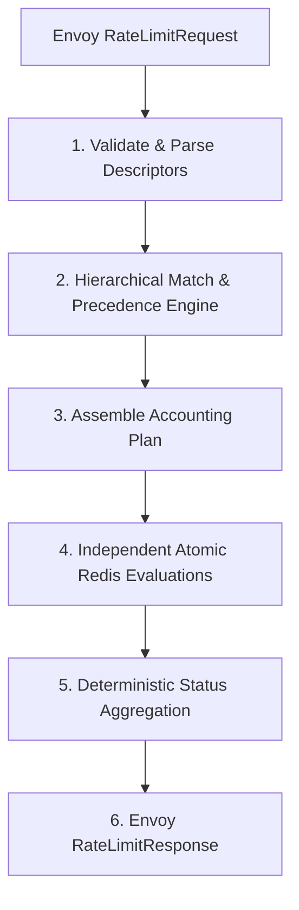
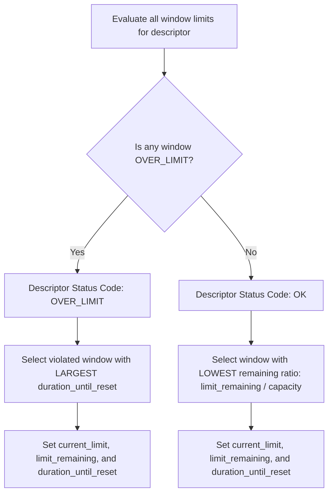
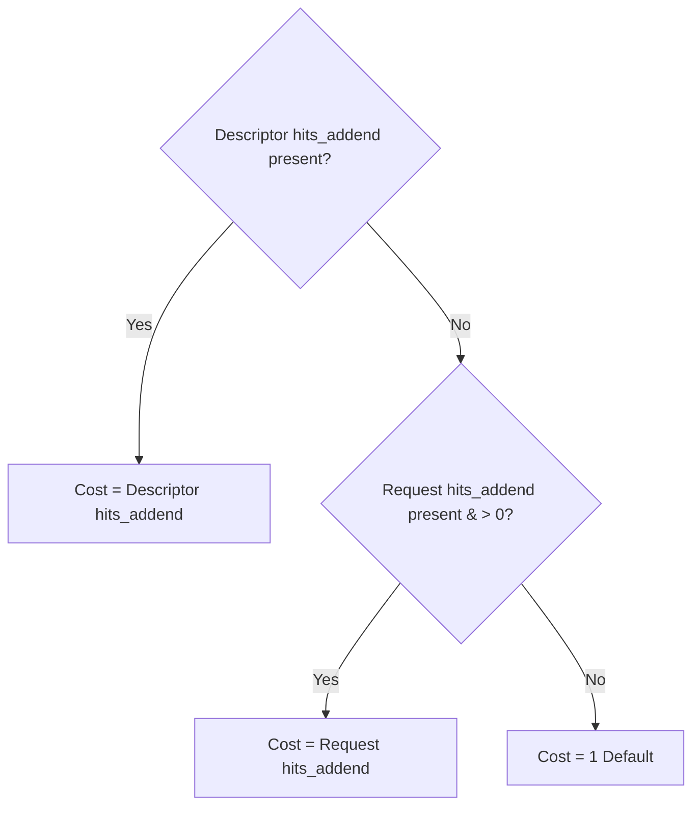

# Steward Accounting, Matching, and Counter Identity Contract

**Document Version:** 1.0.0  
**Status:** Ratified Production Contract  
**Milestone:** M0 (Informs M1.2, M1.4, M2.4)  
**Target Issue:** cetanu/steward#4  
**Resolves:** Production readiness findings F01, F02, F10, and F11 in [docs/production-readiness.md](file:///home/vsyrakis/Documents/steward/docs/production-readiness.md)

---

## 1. Executive Summary & Purpose

Steward provides distributed rate limiting conforming to the Envoy v3 gRPC Rate Limit Service (`RateLimitService`) protocol. Prior implementations in Steward exhibited critical semantic gaps:
- **F01:** Descriptors were flattened into independent key/value lookups, discarding entry order, hierarchy, and parent scope isolation.
- **F02:** Descriptor-level `hits_addend` and `is_negative_hits` (refunds) were ignored, and zero-cost checks were unhandled.
- **F10:** Mutable rate limit thresholds (capacity and unit) were baked into Redis state keys, causing accidental quota resets during configuration rollouts.
- **F11:** Accounting semantics across multi-window rules, calendar boundaries, and partial multi-rule consumption were undocumented and varied unpredictably across algorithms.

This specification establishes the **normative contract** for descriptor matching, counter identity, hit costs, window boundaries, and multi-rule accounting across all Steward components. Implementation work in Milestone M1 (Fixed Window engine) and Milestone M2 (Async execution and certified algorithms) **must adhere strictly to this document**.



---

## 2. Core Protocol Model & Request Validation

### 2.1 Protocol Mapping
Steward implements the Envoy `RateLimitService.ShouldRateLimit` RPC defined in `envoy.service.ratelimit.v3`:

- **Request:**
  - `domain` (`string`): Configuration tenant namespace (e.g., `edge-gateway`, `service-mesh`).
  - `descriptors` (`repeated RateLimitDescriptor`): List of hierarchical descriptors evaluated against the domain's policy tree.
  - `hits_addend` (`uint32`): Request-level hit cost addend (defaults to `1` when omitted or zero, unless overridden at the descriptor level).
- **Descriptor (`RateLimitDescriptor`):**
  - `entries` (`repeated Entry`): Non-empty ordered list of key/value pairs representing a hierarchical path.
  - `hits_addend` (`google.protobuf.UInt64Value`): Optional descriptor-specific hit cost addend that overrides the request-level addend.
  - `is_negative_hits` (`bool`): Optional flag indicating a quota refund operation.
  - `limit` (`RateLimitOverride`): Optional client-supplied limit override (`requests_per_unit`, `unit`).
- **Response:**
  - `overall_code` (`Code`): Overall decision (`OK` or `OVER_LIMIT`).
  - `statuses` (`repeated DescriptorStatus`): Exactly one status per input descriptor, matching request order 1:1.

### 2.2 Input Dimensions & Bounds
To prevent resource exhaustion attacks and bounded Redis execution (F04), requests exceeding the following hard operational bounds must be rejected immediately at admission with gRPC `INVALID_ARGUMENT`:

| Dimension | Maximum Bound | Validation Rationale |
| :--- | :--- | :--- |
| **Max Encoded Request Size** | 64 KiB | Prevents oversized gRPC payload processing. |
| **Max Descriptors per Request** | 16 | Bounds sequential or concurrent Redis operations per call. |
| **Max Entries per Descriptor** | 8 | Bounds matching tree depth and Redis key lengths. |
| **Max Entry Key / Value Length** | 256 bytes | Prevents unbounded Redis memory consumption per counter key. |
| **Max `hits_addend`** | 10,000 | Prevents integer overflow and massive sorted set allocations in sliding windows. |
| **Minimum Entries per Descriptor** | 1 | Empty descriptor lists are strictly invalid under Envoy protobuf validation. |

---

## 3. Hierarchical Matching Semantics

### 3.1 Descriptors as Ordered Entry Sequences
A rate limit descriptor is an **ordered sequence** of entries:
$$\mathcal{D} = \big[ (k_1, v_1), (k_2, v_2), \dots, (k_n, v_n) \big]$$
where each $k_i$ is a non-empty string descriptor key and $v_i$ is a string descriptor value.

> [!IMPORTANT]
> **Descriptor entry order is strictly significant.**
> Descriptor equality is defined as:
> $$\mathcal{D}_A = \mathcal{D}_B \iff |\mathcal{D}_A| = |\mathcal{D}_B| \land \forall i \in \{1, \dots, n\}: (k_{A,i} = k_{B,i} \land v_{A,i} = v_{B,i})$$
> Matching is **non-commutative**. Specifically:
> `[(tenant, acme), (route, /pay)]` $\mathbf{\neq}$ `[(route, /pay), (tenant, acme)]`.
> A policy configured for `tenant -> route` MUST NOT match a request sending `route -> tenant`.

### 3.2 Parent Scope Isolation
Configuration policies are represented as an ordered prefix tree (trie) rooted at a `domain`. Each tree node at depth $d$ is qualified exclusively by the exact sequence of ancestor nodes at depths $1 \dots d-1$.

- **Scope Confinement:** Child rules configured under parent node $P_1$ are completely isolated from child rules configured under parent node $P_2$.
- **No Cross-Scope Leakage:** If policy defines:
  - `tenant: acme` $\rightarrow$ `route: /pay` (Limit: 10 req/min)
  - `tenant: globex` $\rightarrow$ (No child rules)
  - A request descriptor `[(tenant, globex), (route, /pay)]` **must not** match Acme's `/pay` rule. The evaluation fails to find a rule under `globex` and is treated as an unmatched descriptor.

```
Domain: default
├── tenant: acme
│   └── route: /pay               --> Rule A (10 req/min) [Scoped to Acme only]
│   └── route: *                  --> Rule B (50 req/min) [Acme wildcard fallback]
└── tenant: globex
    └── (no child rules)          --> Does NOT inherit Rule A or Rule B
```

### 3.3 Leaf Path Matching
A descriptor matches a policy if and only if:
1. Every entry in the descriptor sequence traverses a valid node in the policy tree from root to leaf.
2. The traversal terminates at a configured **leaf rule** containing rate limit specifications.
3. Partial path matches (where a descriptor terminates prematurely on an interior branch node that possesses no rate limits) are treated as **unmatched**.

### 3.4 Duplicate Descriptors in a Single Request
When a request contains duplicate descriptors (e.g., `[D_1, D_2, D_1]`):
- **Response Shape:** `RateLimitResponse.statuses` must contain an individual status entry for each descriptor at its exact input index (length matches input length).
- **Accounting Intent:** Each descriptor instance represents an explicit rate limiting assertion requested by Envoy. Therefore, duplicate descriptors are evaluated and charged **sequentially and additively**. The first instance consumes its hits addend from the counter; the second instance consumes its hits addend from the updated counter state.

---

## 4. Precedence Rules & Unmatched Handling

### 4.1 Exact Match vs. Wildcard Precedence
Policy nodes at any depth may specify:
1. **Exact Match:** An explicit key and literal value (e.g., `user_id: "admin"`).
2. **Wildcard Match:** An explicit key with a wildcard value (denoted by `*` or an empty value `""` per Envoy convention), representing any value supplied by the client.

> [!IMPORTANT]
> **Deterministic Exact-Over-Wildcard Precedence:**
> When evaluating an entry $(k, v)$ against sibling nodes in the policy tree where both an exact match for $v$ and a wildcard match exists:
> 1. The **exact match** rule MUST be evaluated first.
> 2. The **wildcard** rule is evaluated **only if no exact match exists** for $v$.
> 3. Under no circumstances may both exact and wildcard rules execute for the same descriptor entry.

#### Precedence Table Example
Given configuration:
1. `(tenant, acme) -> (route, /pay)`: 5 req/s
2. `(tenant, acme) -> (route, *)`: 50 req/s
3. `(tenant, *) -> (route, /pay)`: 20 req/s
4. `(tenant, *) -> (route, *)`: 100 req/s

| Request Descriptor | Selected Rule | Rationale |
| :--- | :--- | :--- |
| `[(tenant, acme), (route, /pay)]` | **Rule 1** | Depth 1 exact (`acme`), Depth 2 exact (`/pay`). |
| `[(tenant, acme), (route, /search)]` | **Rule 2** | Depth 1 exact (`acme`), Depth 2 wildcard matches `/search`. |
| `[(tenant, globex), (route, /pay)]` | **Rule 3** | Depth 1 wildcard matches `globex`, Depth 2 exact (`/pay`). |
| `[(tenant, globex), (route, /search)]` | **Rule 4** | Depth 1 wildcard (`globex`), Depth 2 wildcard (`/search`). |

### 4.2 Dynamic Value Extraction from Wildcard Matches
When a wildcard rule matches an entry $(k, v)$, the **actual runtime value** $v$ supplied in the request is captured and bound into the counter's canonical identity. This ensures dynamic per-tenant, per-IP, or per-user rate limit isolation without requiring static configuration of every possible client identifier.

### 4.3 Unmatched Descriptor Handling
When an input descriptor does not match any configured rule in the domain's policy tree:

1. **Enforcement Behavior:** Unmatched descriptors are **unconstrained**. No Redis counter operations (reads or writes) are performed.
2. **Descriptor Status Construction:**
   - `code`: `Code::OK` (1)
   - `current_limit`: `None` (omitted in protobuf)
   - `limit_remaining`: `0` (default protobuf integer)
   - `duration_until_reset`: `None` (omitted in protobuf)
3. **Overall Response Code Impact:** An unmatched descriptor does **not** cause an `OVER_LIMIT` response. If all descriptors in a request are unmatched, `overall_code` is `Code::OK`.
4. **Telemetry & Metrics:**
   - Increment `descriptors.unmatched` with bounded metric tags (`domain`).
   - *Never* emit dynamic descriptor values as metric labels (F13).
   - If an entire domain is unconfigured, increment `requests.unconfigured` and return `Code::OK` with empty statuses.

---

## 5. Multi-Window Rules & Status Aggregation

### 5.1 Multi-Window Specification
A single matched descriptor path may be constrained by **multiple rate limits across different time windows** (e.g., short-term burst protection alongside long-term quota enforcement).

Example policy configuration:
```yaml
domain: default
descriptors:
  - key: tenant
    value: acme
    rate_limits:
      - unit: second
        requests_per_unit: 10
      - unit: minute
        requests_per_unit: 100
      - unit: hour
        requests_per_unit: 2000
```

Each configured window maintains an **independent counter** in Redis with its own canonical key and expiration lifecycle.

### 5.2 Deterministic Status Aggregation
Envoy's protocol returns a single `DescriptorStatus` for each descriptor, even when multiple window limits are enforced. The fields of `DescriptorStatus` must be aggregated deterministically according to the following ratified rules:



#### Rule 1: Decision Code Conjunction
$$\text{descriptor.code} = \begin{cases} \text{Code::OVER\_LIMIT} & \text{if } \exists w \in \mathcal{W}: \text{status}(w) = \text{OVER\_LIMIT} \\ \text{Code::OK} & \text{if } \forall w \in \mathcal{W}: \text{status}(w) = \text{OK} \end{cases}$$

#### Rule 2: Over-Limit Status Governing Rule
When one or more windows are violated:
- **Governing Window:** The violated window ($status(w) = \text{OVER\_LIMIT}$) having the **largest `duration_until_reset`** (i.e., the window requiring the client to wait the longest before recovery).
- **Tie-Breaker:** If `duration_until_reset` is equal, select the window with the **shortest unit duration** (e.g., second over minute).
- **Field Assignment:** `current_limit`, `limit_remaining`, and `duration_until_reset` are populated directly from this governing window.
- **Header Benefit:** This ensures Envoy populates `Retry-After` and `X-RateLimit-Reset` with the true duration until the client's block is relieved.

#### Rule 3: Allowed Status Governing Rule
When all windows are allowed:
- **Governing Window:** The window having the **lowest ratio of remaining capacity**:
  $$\text{governing\_window} = \arg\min_{w \in \mathcal{W}} \left( \frac{\text{limit\_remaining}(w)}{\text{requests\_per\_unit}(w)} \right)$$
- **Tie-Breaker:** If ratios are equal, select the window with the **lowest absolute `limit_remaining`**, then the **shortest unit duration**.
- **Field Assignment:** `current_limit`, `limit_remaining`, and `duration_until_reset` are populated from this governing window.
- **Header Benefit:** Downstream clients receive `X-RateLimit-Remaining` reflecting their nearest exhaustion threshold.

### 5.3 Overall Response Code Aggregation
The top-level `RateLimitResponse.overall_code` is the conjunction across all input descriptor statuses:
$$\text{overall\_code} = \begin{cases} \text{Code::OVER\_LIMIT} & \text{if } \exists d \in \text{statuses}: d.\text{code} = \text{Code::OVER\_LIMIT} \\ \text{Code::OK} & \text{otherwise} \end{cases}$$

---

## 6. Hit Cost & Refund Semantics

### 6.1 Hit Cost Precedence & Defaults
Hit cost specifies the number of quota units consumed by a request. The effective hit cost $c_d$ for descriptor $d$ is determined by strict precedence:



1. **Descriptor Precedence:** If `RateLimitDescriptor.hits_addend` is set (present as a protobuf wrapper `UInt64Value`), its value strictly overrides any request-level addend.
2. **Request Fallback:** If descriptor `hits_addend` is null/unset, the value from `RateLimitRequest.hits_addend` is used if $> 0$.
3. **Default:** If neither is set, hit cost defaults to `1`.
4. **Validation & Overflow Guard:**
   - Any hit cost exceeding the application bound ($10,000$) is rejected with `INVALID_ARGUMENT`.
   - Cast from `u64` to internal representation must verify $c_d \le 10,000$ without truncation.

### 6.2 Zero-Hit Semantics (`hits_addend == 0`)
A descriptor evaluated with an effective hit cost of zero ($c_d = 0$) represents a **quota probe (dry-run query)**:
- **No State Mutation:** No counter increments, no token deductions, and no sliding window log insertions are executed in Redis.
- **Evaluation Logic:**
  - Fixed Window: Reads counter value. Allowed if $\text{current} < \text{capacity}$.
  - Token Bucket: Reads token balance. Allowed if $\text{tokens} \ge 1.0$.
  - Sliding Window: Counts events in window. Allowed if $\text{event\_count} < \text{capacity}$.
- **Result:** Returns `Code::OK` or `Code::OVER_LIMIT` along with accurate `limit_remaining` and `duration_until_reset` without consuming any quota.

### 6.3 Negative-Hit Refund Semantics (`is_negative_hits == true`)
When `RateLimitDescriptor.is_negative_hits` is `true`, the operation is a **quota refund / replenishment**:
$$\Delta = -c_d$$

#### A. Authorization & Security Gate
Refunding rate limits allows arbitrary replenishment of service quota.
> [!CAUTION]
> **Negative hits MUST be restricted to authorized, trusted callers (F14).**
> - Requests containing `is_negative_hits == true` are permitted ONLY when originating from an authenticated internal control plane or Envoy proxy with verified mutual TLS (mTLS) or trusted internal gRPC metadata.
> - Untrusted or external callers attempting negative hits MUST be rejected with gRPC `PERMISSION_DENIED`.

#### B. Algorithm Compatibility Matrix

| Algorithm | Refund Supported? | Implementation & Boundary Clamping Semantics |
| :--- | :---: | :--- |
| **Token Bucket** | **YES** | Increments token balance: $\text{tokens}' = \min(\text{capacity}, \text{tokens} + c_d)$. **Clamped at maximum capacity.** |
| **Fixed Window** | **YES** | Decrements window counter: $\text{current}' = \max(0, \text{current} - c_d)$. **Clamped at 0 (cannot be negative).** |
| **Sliding Window** | **NO** | **Explicitly Unsupported.** Discrete event log member deletion without event IDs requires expensive scan/pruning ($O(K)$) or breaks event idempotency. Requests attempting refunds against sliding-window policies return gRPC `FAILED_PRECONDITION`. |

#### C. Capacity Clamping Invariants
- A refund **cannot exceed 100% capacity** (token buckets cannot accumulate bonus burst capacity above configured limit).
- A counter **cannot drop below 0** (fixed window usage cannot become negative).
- Successful refund operations return `Code::OK` with the replenished `limit_remaining`.

---

## 7. Counter Identity & Redis Key Architecture

### 7.1 Decoupling Counter Identity from Mutable Thresholds
Finding **F10** demonstrated that baking `requests_per_unit` (capacity) into Redis keys creates new counters whenever limits are tuned, causing split-brain enforcement during deployments and instant quota resets.

> [!IMPORTANT]
> **Normative Decoupling Invariant:**
> A Redis counter's identity is a function **solely of policy identity and canonical matched descriptor values**.
> Redis keys **MUST NOT** contain mutable threshold attributes such as `requests_per_unit` (capacity).
> Threshold modifications take effect immediately within Redis Lua scripts without altering the underlying key identity.

### 7.2 Structural State vs. Threshold Attributes
- **Threshold Attributes (Excluded from Key):** `requests_per_unit` (capacity), client limit overrides. These are passed as runtime arguments (`ARGV`) to Lua scripts.
- **Structural Attributes (Included in Key):**
  - `algorithm`: Redis data structures are incompatible across algorithms (Fixed Window = String integer, Token Bucket = Hash, Sliding Window = Sorted Set). An algorithm change without a key change produces Redis `WRONGTYPE` fatal errors.
  - `window_unit` / duration: Multiple windows on the same descriptor (e.g., second vs. minute) require distinct state tracking keys.

### 7.3 Canonical Key Syntax
All Steward keys adhere to the canonical syntax:
```
steward:{<hash_tag>}:<version>:<policy_id>:<encoded_path>:<algorithm>:<unit_spec>
```

#### Key Component Definitions
1. **Namespace:** `steward`
2. **Cluster Hash Tag (`{<hash_tag>}`):**
   - Enclosed in `{...}` for deterministic Redis Cluster slot routing.
   - Set to `{domain}` (or `{domain:policy_id}`). This guarantees that auxiliary keys or multi-window keys for a tenant map to the same Redis cluster slot without spreading across slots.
3. **State Schema Version (`v1`):** Isolates state across incompatible schema migrations.
4. **Policy Identifier (`<policy_id>`):** Unique identifier of the policy rule.
5. **Canonical Encoded Path (`<encoded_path>`):**
   - A length-prefixed, collision-resistant concatenation of all entries:
     $$\text{len}(k_1):k_1=\text{len}(v_1):v_1/\text{len}(k_2):k_2=\text{len}(v_2):v_2/\dots$$
   - For wildcard rules, the **actual matched dynamic value** is serialized into the path, ensuring tenant/client isolation.
6. **Algorithm (`<algorithm>`):** `fw` (Fixed Window), `tb` (Token Bucket), or `sw` (Sliding Window).
7. **Window Specification (`<unit_spec>`):** The duration token (e.g., `1s`, `60s`, `3600s`).

#### Concrete Key Examples
- **Fixed Window (Exact match, 1-minute window):**
  ```
  steward:{default}:v1:pol_pay:6:tenant=4:acme/5:route=4:/pay:fw:60s
  ```
- **Token Bucket (Wildcard matched with user `user_891`, 1-second window):**
  ```
  steward:{default}:v1:pol_api:6:tenant=4:acme/7:user_id=8:user_891:tb:1s
  ```

### 7.4 Client Rate Limit Overrides (`RateLimitOverride`)
When a request provides a `RateLimitOverride`:
- The counter key remains **identical** to the canonical counter key.
- The override values (`requests_per_unit`, `unit`) are supplied as script arguments.
- Multiple callers targeting the same descriptor share the unified counter state under the caller's dynamic threshold.

---

## 8. Window Boundaries & Multi-Rule Accounting

### 8.1 Calendar-Aligned vs. First-Hit Anchored Windows

#### Ratification: Calendar-Aligned Windows for Fixed Windows
Steward ratifies **calendar-aligned (epoch-aligned) windows** as the authoritative window model for Fixed Window rate limiting:
- **Wall-Clock Alignment:** Window boundaries snap to Unix epoch multiples:
  $$T_{\text{start}} = \left\lfloor \frac{T_{\text{now}}}{W_{\text{duration}}} \right\rfloor \times W_{\text{duration}}$$
  $$T_{\text{end}} = T_{\text{start}} + W_{\text{duration}}$$
  $$\text{duration\_until\_reset} = T_{\text{end}} - T_{\text{now}}$$
- **Authoritative Time Source:** Scripts use Redis server time (`TIME` command) rather than client application clocks (F03) to prevent clock skew across replicas.
- **Key TTL Lifecycle:** Keys are created with Redis expiry set to:
  $$\text{TTL} = (T_{\text{end}} - T_{\text{now}}) + \text{safety\_margin}$$
  where $\text{safety\_margin} = \min(W_{\text{duration}}, 10\text{s})$ prevents early eviction before boundary rollovers.
- **Why Anchored Windows Are Rejected:** First-hit anchored windows reset $W$ seconds after an arbitrary initial hit. Across distributed clients, anchored windows permit up to $2 \times$ burst overshoot across boundaries and drift inconsistently across replicas.

```
Calendar Aligned:
|-------- Minute 00:01 --------|-------- Minute 00:02 --------|
[-- hits --]                   [-- hits --]                   --> Clean reset at 00:02:00

First-Hit Anchored:
       [First hit @ 00:01:45]-------- Window (60s) -------->[Expires 00:02:45]
                                [Bursts across boundary!]
```

### 8.2 Admission vs. Attempt Counting
- **Fixed Window:**
  - Standard counting: A request that exceeds capacity is rejected.
  - **Counter Clamping:** Counters MUST NOT increment indefinitely beyond capacity during prolonged denial floods. The script increments only up to $\text{capacity} + 1$, preventing integer overflow and infinite reset penalties.
- **Token Bucket & Sliding Window:**
  - Consume quota **only on allowed requests**. Denied requests do not deduct tokens or insert sliding log entries.

### 8.3 Multi-Rule Accounting: Independent Updates Without Rollback
A single gRPC request frequently matches multiple independent descriptor rules or multi-window policies.

> [!IMPORTANT]
> **Normative Multi-Rule Atomicity Invariant:**
> 1. Redis atomic operations are guaranteed **strictly per-counter key** via individual Redis Lua scripts.
> 2. Rate limit evaluation executes **without distributed cross-key transactions or cross-key rollbacks**.
> 3. Individual rule updates are **independent**: if Rule 1 is allowed and consumed, but Rule 2 subsequently fails (`OVER_LIMIT`), Rule 1's consumption **is not rolled back**.

#### Architectural Justification
1. **Redis Cluster Compatibility:** In a sharded Redis cluster, different descriptor keys (e.g., a global route key and a client-specific IP key) map to distinct cluster slots and different Redis nodes. Multi-key transactions (`MULTI`/`EXEC` or cross-slot Lua) are forbidden by Redis Cluster architecture.
2. **Timeout & Partition Resilience:** Cross-key distributed two-phase rollback under high concurrency introduces cascading deadlocks, connection pool exhaustion, and unpredictable latency amplification during network blips.
3. **DoS & Abuse Protection:** If a client exhausts one layer of defense (e.g., route limit), the client has consumed edge service resources and legitimately incurs hit costs on outer layers (e.g., tenant or IP limit).

---

## 9. Normative Summary & Qualification Matrix

### 9.1 Contract Summary Matrix

| Dimension | Ratified Specification | Reference Finding |
| :--- | :--- | :--- |
| **Matching Order** | Ordered entry sequence: $[(k_1, v_1), \dots, (k_n, v_n)]$. Non-commutative. | F01 |
| **Scope Isolation** | Strict parent-context isolation; no cross-branch rule inheritance. | F01 |
| **Precedence** | Exact match strictly precedes wildcard match at every hierarchy level. | F01 |
| **Unmatched Rule** | Returns `Code::OK`, null limit, no Redis mutation. Increments `descriptors.unmatched`. | F01, F13 |
| **Multi-Window** | Fully supported. Aggregates to worst-case status on deny, lowest ratio on allow. | F01, F09 |
| **Hit Addend** | Descriptor addend takes precedence over request addend; defaults to `1`. | F02 |
| **Zero Hits** | Read-only quota probe; returns status without consuming state. | F02 |
| **Refunds** | Supported for Token Bucket and Fixed Window. Clamped at bounds. Gated by caller auth. | F02, F14 |
| **Counter Identity** | Decoupled from capacity. Function of domain, policy ID, encoded path, algo, unit. | F10 |
| **Window Boundary** | Fixed Window is calendar-aligned to Unix epoch using Redis server time. | F03, F11 |
| **Multi-Rule Atomic** | Per-key atomic updates. Independent evaluation without cross-key rollback. | F11 |

### 9.2 Acceptance & Test Specification for M1 & M2

The following qualification test cases must be implemented in `tests/` to ratify milestone completion:

```
TC-MATCH-01: Entry order sensitivity (verify [(a,1), (b,2)] != [(b,2), (a,1)])
TC-MATCH-02: Scope isolation (verify sibling branches do not leak rules)
TC-MATCH-03: Exact vs. wildcard precedence (verify exact matches win deterministically)
TC-MATCH-04: Wildcard dynamic value binding in Redis key
TC-MATCH-05: Unmatched descriptor returns OK with empty limit and increments metric
TC-MULTI-01: Dual-window descriptor (verify both second and minute counters update)
TC-MULTI-02: Multi-window status aggregation on allow (lowest remaining ratio selected)
TC-MULTI-03: Multi-window status aggregation on deny (largest reset duration selected)
TC-HIT-01:   Descriptor hits_addend overrides request hits_addend
TC-HIT-02:   Zero-cost probe verifies remaining quota without decrementing counter
TC-HIT-03:   Negative hits refund token bucket and clamps at maximum capacity
TC-HIT-04:   Negative hits refund fixed window and clamps at zero
TC-HIT-05:   Negative hits rejected for unauthorized callers and sliding window
TC-IDENT-01: Updating capacity in configuration retains existing Redis counter key
TC-IDENT-02: Changing algorithm creates distinct counter key without WRONGTYPE error
TC-BOUND-01: Fixed window reset aligns precisely to calendar epoch boundary
TC-BOUND-02: Partial consumption persists on allowed rule when sibling rule is denied
```
