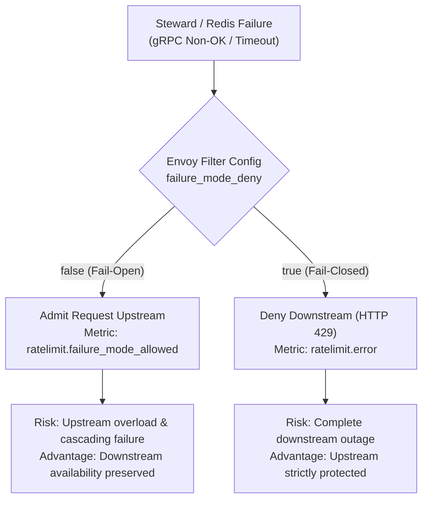
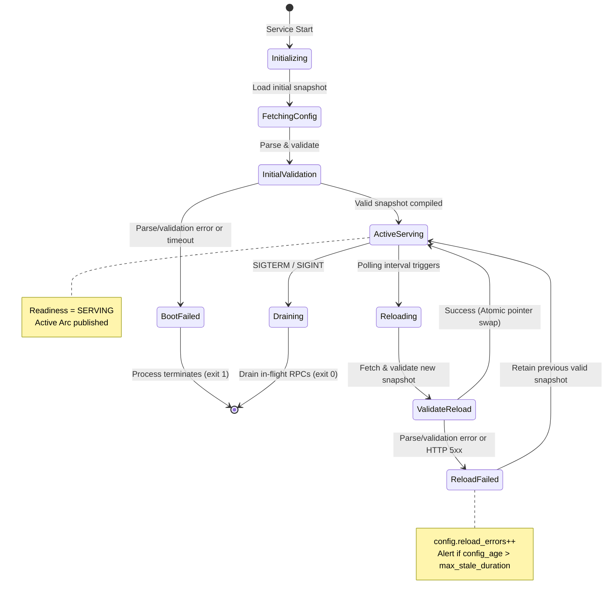
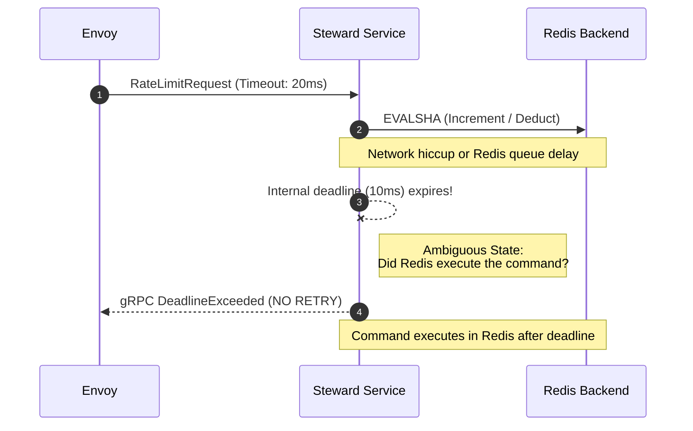
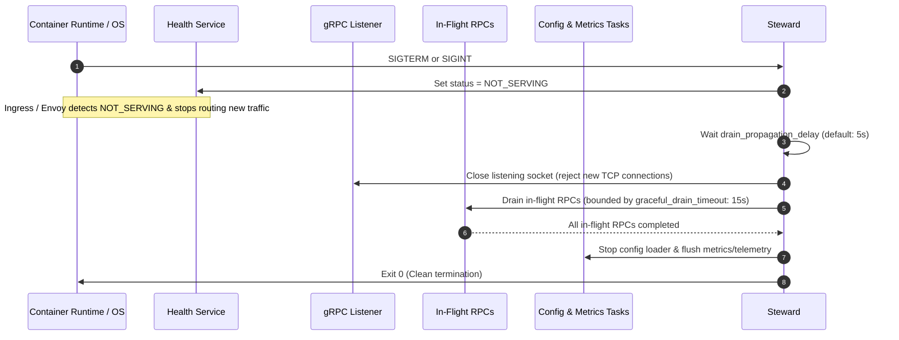

# Steward Failure Modes, Error Precedence, and Configuration Lifecycle Policy

**Document Status:** Ratified Engineering Specification  
**Milestone:** M0.3 (Contract and qualification plan)  
**Informs:** M1.3 (Configuration snapshots), M1.5 (Statuses & error propagation), M2.2 (Deadlines & admission), M3.3 (Readiness & graceful drain), M3.4 (Loader hardening)  
**Resolves Findings:** [F05](file:///home/vsyrakis/Documents/steward/docs/production-readiness.md#L126), [F06](file:///home/vsyrakis/Documents/steward/docs/production-readiness.md#L140), [F12](file:///home/vsyrakis/Documents/steward/docs/production-readiness.md#L214), [F15](file:///home/vsyrakis/Documents/steward/docs/production-readiness.md#L248)  
**Target Audience:** Platform/SRE teams, service owners, Envoy operators, and backend engineers.

---

## 1. Executive Summary

This specification establishes the authoritative production contract for how Steward and its Envoy integration handle failures, dependency outages, configuration drift, and ambiguous network outcomes. 

Prior to this specification, Steward exhibited four critical failure vulnerabilities identified in [`docs/production-readiness.md`](file:///home/vsyrakis/Documents/steward/docs/production-readiness.md):
1. **F05 (Startup Blindness):** The service bound and served immediately with an empty snapshot while asynchronously fetching configuration, admitting arbitrary traffic without intended limits.
2. **F06 (Silent Error Masking):** Redis errors were caught and converted into successful allowed responses (`allowed: true, observed: 0`), preventing Envoy from applying its configured `failure_mode_deny` policy.
3. **F12 (Uncontrolled Configuration Drift):** Configuration fetching lacked size bounds, loader health supervision, and a bounded stale-configuration policy.
4. **F15 (Missing Lifecycle & Readiness):** The service lacked a gRPC health/readiness service, graceful drain protocol, and SIGTERM coordination, causing dropped requests and unready traffic admission during deployments.

This document ratifies the binding behavioral rules to eliminate these failure modes across Milestones M1 through M3.

---

## 2. Envoy Failure Mode Strategy

Envoy's HTTP Rate Limit Filter ([`envoy.filters.http.ratelimit`](https://www.envoyproxy.io/docs/envoy/latest/configuration/http/http_filters/rate_limit_filter)) defines how ingress and edge proxies respond when the external Rate Limit Service (Steward) fails or is unreachable. This behavior is governed by the filter parameter `failure_mode_deny`.

```yaml
# Example Envoy HTTP filter snippet
- name: envoy.filters.http.ratelimit
  typed_config:
    "@type": type.googleapis.com/envoy.extensions.filters.http.ratelimit.v3.RateLimit
    domain: default
    failure_mode_deny: false # or true
    rate_limit_service:
      grpc_service:
        envoy_grpc:
          cluster_name: rls
        timeout: 0.020s # Explicit 20ms RPC timeout
      transport_api_version: V3
```

### 2.1 Mechanics: Failure-Open vs. Failure-Closed

When Envoy issues a `ShouldRateLimit` gRPC check to Steward, three broad outcomes can occur:

| RLS Interaction Outcome | gRPC Status / Response Payload | Envoy Behavior (`failure_mode_deny: false`) | Envoy Behavior (`failure_mode_deny: true`) |
| --- | --- | --- | --- |
| **Definitive Allow** | `Status::OK` with `overall_code = OK` | Request forwarded upstream | Request forwarded upstream |
| **Definitive Rejection** | `Status::OK` with `overall_code = OVER_LIMIT` | Downstream rejected (HTTP 429) | Downstream rejected (HTTP 429) |
| **Service Error / Outage** | Non-OK gRPC status (`Unavailable`, `DeadlineExceeded`, etc.) or network drop | **Fail-Open:** Request forwarded upstream. Emits `ratelimit.failure_mode_allowed`. | **Fail-Closed:** Downstream rejected (HTTP 429 or 500/503). Emits `ratelimit.error`. |

> [!IMPORTANT]
> **The F06 Coupling Invariant:**  
> Envoy's `failure_mode_deny` setting is **completely bypassed** if Steward catches dependency errors and responds with gRPC `OK` (`overall_code = OK`). Envoy can only apply its configured failure policy when Steward exposes backend failures as non-OK gRPC statuses.

### 2.2 Risk Profiles and Trade-Off Analysis



#### Failure-Open (`failure_mode_deny: false`)
- **Philosophy:** Prioritize end-user availability over quota enforcement during transient infrastructure failures.
- **Exposure:** Requests bypass rate limits during Steward or Redis degradation. A surge during an outage may overload downstream databases, saturate application connection pools, or cause cascading microservice failures.
- **Appropriate Workloads:**
  - Internal service-to-service communication where upstreams have autonomous protection (e.g., local circuit breakers, bulkheads, or concurrency limits).
  - Friendly user throttling, consumer UX throttling, and soft performance shaping.
  - Analytics, search indexing, or read-heavy non-mutating APIs.

#### Failure-Closed (`failure_mode_deny: true`)
- **Philosophy:** Prioritize upstream system survival, resource preservation, and strict monetization/security boundaries over downstream availability.
- **Exposure:** Any failure in Steward, Redis, or their interconnect converts into an immediate outage for downstream clients (HTTP 429 rejections). Availability is tightly coupled to the availability of Steward and Redis.
- **Appropriate Workloads:**
  - Public ingress / edge APIs defending against DDoS, credential stuffing, or brute-force attacks.
  - Hard billing/monetization tiers where unmetered calls represent direct financial loss or third-party cost exposure (e.g., paid AI inference tokens, SMS gateways).
  - Fragile or capacity-constrained legacy backends that immediately collapse under unthrottled load.

### 2.3 Deployment Recommendations by Tier

1. **Tier 0 Public Edge Ingress:**
   - **Recommendation:** `failure_mode_deny: true` (Fail-Closed).
   - **Mitigation:** Deploy multi-replica Steward across availability zones with Redis Sentinel/Cluster HA, strict timeout budgets (Envoy RPC timeout $\le$ 20 ms), and automated alert escalation.
2. **Internal Service Mesh (East-West Traffic):**
   - **Recommendation:** `failure_mode_deny: false` (Fail-Open).
   - **Mitigation:** Upstream services MUST implement local token bucket or concurrency limits as defense-in-depth. SRE alerts on `ratelimit.failure_mode_allowed > 0.1%` of traffic.
3. **Staging and Pre-Production Environments:**
   - **Recommendation:** `failure_mode_deny: true` (Fail-Closed).
   - **Rationale:** Prevents developers and testers from silently masking Redis disconnections, missing authentication credentials, or misconfigured network policies during testing.

---

## 3. Error Precedence Policy (The F06 Rule)

To guarantee that Envoy's failure policy operates correctly and that no client bypasses quota through dependency failure, Steward adopts the **F06 Error Precedence Rule**.

### 3.1 The Cardinal Axioms

1. **Definitive Quota Denial Wins:** If any matched descriptor or rule evaluates to `OVER_LIMIT`, the overall decision MUST be `OVER_LIMIT`, regardless of whether other rules or descriptors experienced Redis failures, timeouts, or connection drops.
2. **Backend Failures Must Not Mask As Normal Traffic:** If no rule has definitively rejected the request, any unresolved backend error, connection drop, timeout, or Redis script failure MUST be returned as a non-OK gRPC status (`Status::unavailable` or `Status::deadline_exceeded`).
3. **No Disguised Decisions:**
   - A dependency failure MUST NEVER be returned as an `OK` (allow).
   - A dependency failure MUST NEVER be returned as a normal `OVER_LIMIT` unless a valid counter actually reached or exceeded its limit.

### 3.2 Decision Precedence Matrix

For an incoming `RateLimitRequest` containing $N$ descriptors evaluating $M$ rules:

| Matched Rules Outcome | Redis / Backend Status | Overall gRPC Response | Envoy RateLimit Action | Rationale |
| --- | --- | --- | --- | --- |
| At least one rule is `OVER_LIMIT` | Healthy / All succeeded | gRPC `OK` (`overall_code = OVER_LIMIT`) | Downstream rejected (HTTP 429) | Normal rate limit breach. |
| At least one rule is `OVER_LIMIT` | Partial Redis failure or timeout on other rules | gRPC `OK` (`overall_code = OVER_LIMIT`) | Downstream rejected (HTTP 429) | **Definitive denial wins.** The client is provably over budget on a valid counter; unresolved checks cannot rehabilitate an exhausted quota. |
| No rule is `OVER_LIMIT`; all rules `OK` | Healthy / All succeeded | gRPC `OK` (`overall_code = OK`) | Downstream allowed | Normal within-quota evaluation. |
| No rule is `OVER_LIMIT`; 1+ rules failed | Redis disconnect, pool exhausted, or Redis OOM | gRPC `Status::unavailable` | Governed by `failure_mode_deny` | Quota state is unknown. Returning `OK` would bypass limits; returning `OVER_LIMIT` would falsely accuse client. Envoy must decide. |
| No rule is `OVER_LIMIT`; 1+ rules failed | Local or client deadline expired | gRPC `Status::deadline_exceeded` | Governed by `failure_mode_deny` | Request budget exhausted before conclusive answer. |
| No rule matches (Unconfigured domain/keys) | N/A (no Redis call) | gRPC `OK` (`overall_code = OK`) | Downstream allowed | Unconfigured traffic behavior per M0.2 contract; records `requests.unconfigured`. |
| Request rejected at admission (overload) | N/A (pre-backend) | gRPC `Status::resource_exhausted` or `unavailable` | Governed by `failure_mode_deny` | Local concurrency limit reached. Sheds load immediately without queuing. |

### 3.3 Backend Error to gRPC Status Mapping

When a backend failure occurs without a definitive `OVER_LIMIT` decision, Steward maps backend errors to standard gRPC statuses:

```rust
// Contractual mapping in Steward service layer
match backend_error {
    BackendError::Timeout | BackendError::DeadlineExceeded => {
        tonic::Status::deadline_exceeded("backend rate limit evaluation timed out")
    }
    BackendError::ConnectionDropped | BackendError::PoolExhausted => {
        tonic::Status::unavailable("rate limit storage backend is unavailable")
    }
    BackendError::RedisOom => {
        // Redis maxmemory reached and maxmemory-policy refused write
        tonic::Status::unavailable("storage backend memory exhausted")
    }
    BackendError::AdmissionCapacityExceeded => {
        tonic::Status::resource_exhausted("rate limit service admission capacity reached")
    }
    BackendError::MalformedDescriptor => {
        tonic::Status::invalid_argument("descriptor violates size or structure constraints")
    }
    BackendError::Internal(err) => {
        tonic::Status::internal(format!("unexpected internal error: {err}"))
    }
}
```

---

## 4. Configuration Lifecycle Failure Policy

Configuration controls the rate-limiting rules, thresholds, algorithms, and domain mappings. Lifecycle management must guarantee that bad configurations, slow fetches, or network partitions never compromise enforcement integrity.



### 4.1 Initial Startup Gating (Resolving F05)

1. **Synchronous/Gated Startup:**  
   Steward MUST NOT open its gRPC serving socket or report `SERVING` readiness until an initial configuration snapshot has been fetched, fully validated, and compiled into memory.
2. **Startup Timeout Budget:**  
   Initial configuration loading is bounded by a strict startup budget (default: 30 seconds).
3. **Startup Failure Action:**  
   If the configuration source is unreachable, times out, or fails semantic validation at startup:
   - The service MUST NOT fall back to an empty snapshot.
   - The process MUST log a `FATAL` diagnostic message and terminate with exit code `1` (or remain permanently in `NOT_SERVING` readiness if running in an environment where crashloops are penalized).
   - Traffic is never admitted in an unconfigured state due to startup races.
4. **Intentional Empty Policy:**  
   An empty configuration is only permitted if explicitly declared in the configuration file via an explicit flag (`allow_empty_configuration: true`). Default behavior rejects empty configuration payloads.

### 4.2 Resilient Reloads (Atomic Snapshot Swap)

1. **Background Polling & Compilation:**  
   Configuration reload runs in a supervised background task. The loader fetches and compiles new configuration into an immutable `Arc<CompiledConfig>` in isolated background execution.
2. **Validation Barrier:**  
   The new configuration must pass all semantic validations (valid units, non-zero capacities, valid algorithms, non-overlapping rules) before any references are modified.
3. **Transient Reload Errors:**  
   If a reload attempt encounters a network error (HTTP 5xx, DNS failure, timeout) or a validation failure (malformed JSON/YAML, negative limit):
   - **Retain Active Snapshot:** The running service retains the existing validated `Arc<CompiledConfig>` untouched.
   - **Zero Traffic Drop:** In-flight and new requests continue executing against the current active snapshot without latency interruption.
   - **Observability:** Increment `config.reload_errors`, log a `WARN` with structured error details, and preserve the existing `config.last_reload_success_timestamp`.

### 4.3 Stale Configuration Policy & `max_stale_duration` (Resolving F12)

Configuration freshness is tracked continuously:
$$\text{config\_age\_seconds} = \text{now}() - \text{last\_successful\_reload\_timestamp}$$

The maximum tolerable staleness threshold is configured via `max_stale_duration` (default: **900 seconds / 15 minutes**, or $3 \times \text{config\_refresh\_interval}$, whichever is larger).

When $\text{config\_age\_seconds} > \text{max\_stale\_duration}$, the system enters a **Stale Configuration State**.

#### Policy Options for Stale Configuration

| Policy Option | Behavior when $\text{config\_age} > \text{max\_stale\_duration}$ | Impact on Traffic | Operational Justification |
| --- | --- | --- | --- |
| **Option A: Soft Stale (Default)** | Continue serving the active snapshot. Emit critical alert (`config.stale = 1`). Readiness remains `SERVING`. | No traffic interruption. Limits continue enforcing against last known policy. | **Recommended for production.** Serving slightly outdated rate limits is overwhelmingly better than dropping all traffic (if fail-closed) or removing all replicas from the mesh and admitting unthrottled load. |
| **Option B: Hard Stale (Strict Gating)** | Mark readiness probe `NOT_SERVING`. Envoy removes replica from upstream pool. Traffic ceases to this instance. | Potential traffic drop if entire fleet goes stale simultaneously. | Intended for high-security or multi-datacenter environments where quota convergence is strictly required over availability. |

> [!CAUTION]
> **Fleet-Wide Partition Danger in Option B:**  
> If an upstream configuration repository (e.g., central HTTP config server or Git repo) experiences an outage longer than `max_stale_duration`, Option B will cause **every Steward replica to simultaneously mark itself unready**, resulting in a total rate limit service outage.  
> **Option A is the ratified standard default.** Option B requires explicit operator opt-in (`fail_readiness_on_stale: true`).

---

## 5. Ambiguous Outcome Policy (Timeouts & Partitions)

Rate-limiting operations are stateful mutations. Increments in fixed windows, token deductions in token buckets, and event insertions in sliding logs alter state in Redis. In a distributed architecture, network timeouts create ambiguous execution states.



### 5.1 Prohibition of Blind Mutation Retries

> [!WARNING]
> **Mutations sent to Redis MUST NEVER be blindly retried upon timeout or connection drop.**

**Rationale:**
1. **Double-Charging Risk:** If a command reached Redis, executed, and only the response was delayed, retrying the mutation will debit the user twice. This causes legitimate users to be prematurely throttled (`OVER_LIMIT`).
2. **Retry Amplification Storms:** Timeouts typically occur when Redis is saturated or experiencing queue backpressure. Retrying failed commands multiplies load by $2\times$ or $3\times$, converting transient latency hiccups into catastrophic, unrecoverable Redis outages.

### 5.2 Handling Workflow for Ambiguous Outcomes

When a backend Redis operation times out or drops connection during in-flight evaluation:
1. **Terminate Local Context:** Cancel the local async future and release connection manager resources.
2. **Do Not Retry:** Do not reissue the script execution.
3. **Classify Outcome:** Record telemetry counter `redis.timeouts` or `redis.errors`.
4. **Apply F06 Precedence:**
   - If another rule in the same request already evaluated to `OVER_LIMIT`, return `OVER_LIMIT`.
   - Otherwise, return gRPC `Status::deadline_exceeded` (for timeouts) or `Status::unavailable` (for connection drops).
5. **Delegate to Envoy:** Envoy's `failure_mode_deny` policy determines whether the downstream request is allowed or denied.

### 5.3 Multi-Rule Partial Mutations

A single `RateLimitRequest` may match multiple descriptors and rules across independent Redis keys (e.g., a global per-IP limit and an API-specific per-tenant limit):
- **Independent Execution:** Steward evaluates rules independently. It does **not** perform distributed two-phase commit (2PC) or cross-key rollbacks across Redis shards.
- **Partial Mutation on Failure:** If Rule 1 succeeds (mutating Redis Key 1) and Rule 2 times out:
  - Key 1 remains debited in Redis.
  - The request returns gRPC `Status::deadline_exceeded` to Envoy.
  - If Envoy is fail-closed, the downstream request is rejected, but Key 1 remains incremented.
- **Architectural Trade-Off:** This slight over-charging under partial backend failure is an explicit, ratified design decision. Implementing distributed compensating rollbacks would introduce severe latency, complex failure states, and race conditions for minimal benefit.

---

## 6. Readiness, Liveness, and Graceful Drain Policy (F15)

Steward integrates standard gRPC Health Checking ([`grpc.health.v1.Health`](https://github.com/grpc/grpc/blob/master/doc/health-checking.md)) via `tonic-health` to coordinate with Kubernetes, Nomad, and Envoy service discovery.

### 6.1 Liveness vs. Readiness Separation

| Probe Type | Monitored Attributes | Expected Response Under Failure | Operational Rationale |
| --- | --- | --- | --- |
| **Liveness** (`liveness`) | Tokio runtime event loop responsive; process threads unblocked. | `SERVING` even if Redis is completely down or config is stale. | **Prevents restart storms.** Restarting a process during a Redis outage does not heal Redis; it causes simultaneous boot storms and amplifies infrastructure distress. |
| **Readiness** (`readiness`) | 1. Initial snapshot loaded & validated.<br/>2. Graceful shutdown NOT initiated.<br/>3. `max_stale_duration` not exceeded (if strict mode enabled). | `NOT_SERVING` if initial load failed or shutdown initiated. | Ensures load balancers route traffic only to replicas capable of evaluating policies. |

### 6.2 Graceful Shutdown and Drain Sequence

To ensure zero dropped requests during rolling deployments and container restarts, Steward executes a phased shutdown:



1. **Signal Interception:** Catch `SIGTERM` or `SIGINT`.
2. **De-register Endpoint:** Immediately flip `grpc.health.v1.Health` readiness status to `NOT_SERVING`.
3. **Propagation Delay:** Wait a configurable grace period (`drain_propagation_delay`, default: 5s) to allow upstream Envoy and service mesh routers to propagate endpoint removal.
4. **Stop New Work:** Stop accepting new incoming TCP connections on the serving socket.
5. **Drain In-Flight Requests:** Await completion of all active in-flight RPCs using Tonic's graceful shutdown, bounded by `graceful_drain_timeout` (default: 15s).
6. **Task Supervision:** Cancel the supervised configuration loader task and cleanly flush buffered StatsD telemetry sinks.
7. **Clean Exit:** Terminate the process with exit code `0`.

---

## 7. Observability, Telemetry, and Runbooks

### 7.1 Key Telemetry Metrics

| Metric Name | Type | Description | Alerting Condition |
| --- | --- | --- | --- |
| `requests.total` | Counter | Total rate limit requests received by Steward | Drop to 0 indicates ingress failure. |
| `requests.allowed` | Counter | Requests definitively allowed by policy | Normal operations. |
| `requests.over_limit` | Counter | Requests definitively denied by quota breach | Spikes indicate tenant exhaustion or attack. |
| `requests.unconfigured` | Counter | Requests with no matching policy domain/rules | Unexpected increase indicates configuration mismatch. |
| `grpc.errors` | Counter | gRPC errors returned to Envoy, tagged by status code (`unavailable`, `deadline_exceeded`, `resource_exhausted`) | **P1 Alert:** Any sustained rate > 0.01% of traffic. |
| `redis.errors` | Counter | Redis connection drops, command failures, or OOM errors | **P1 Alert:** > 0 errors over 1 minute. |
| `redis.timeouts` | Counter | Backend commands exceeding internal deadline | **P1 Alert:** > 5 timeouts over 1 minute. |
| `config.reloads` | Counter | Successful policy reload events | Periodic expected increments. |
| `config.reload_errors` | Counter | Failed policy reloads (validation error or source unreachable) | **P2 Alert:** > 3 consecutive reload errors. |
| `config.age_seconds` | Gauge | Elapsed time since last successful configuration reload | **P1 Alert:** Exceeds `max_stale_duration`. |
| `config.stale` | Gauge | Binary flag: `1` if config is stale, `0` otherwise | **P1 Alert:** Value equals 1. |

### 7.2 Corresponding Envoy Metrics

Operators must monitor the rate limit filter metrics emitted by Envoy:
- `ratelimit.ok`: Total allowed requests.
- `ratelimit.over_limit`: Total 429 rejections due to rate limits.
- `ratelimit.error`: Total rate limit checks resulting in errors (monitored for fail-closed impact).
- `ratelimit.failure_mode_allowed`: Total requests admitted upstream due to fail-open policy (`failure_mode_deny: false`).

---

## 8. Summary of Engineering Ratifications

| Requirement Area | Ratified Specification |
| --- | --- |
| **Envoy Failure Strategy** | Documented fail-open vs fail-closed profiles; default recommendation is **Fail-Closed for Public Edge**, **Fail-Open for Internal Mesh**, and **Fail-Closed for Staging**. |
| **Error Precedence (F06)** | **Definitive `OVER_LIMIT` always wins.** All unresolved backend errors MUST return gRPC `Unavailable` or `DeadlineExceeded`. Backend failures MUST NEVER return `OK` or simulated quota denials. |
| **Initial Startup (F05)** | Synchronously validated initial snapshot is **mandatory** before listening or reporting `SERVING` readiness. Process terminates or stays unready on initial boot failure. |
| **Reload Resilience** | Failed reloads **retain the active validated snapshot untouched** without dropping traffic or altering current limits. |
| **Stale Configuration (F12)** | Default policy continues serving active snapshot with critical alert when `config_age > max_stale_duration` (**Soft Stale**). Optional strict mode drops readiness. |
| **Ambiguous Outcomes** | **Blind retries of Redis mutations are strictly prohibited.** Unresolved timeouts return gRPC `DeadlineExceeded`. |
| **Readiness & Drain (F15)** | Standard `grpc.health.v1.Health` integration. Liveness is decoupled from Redis. SIGTERM initiates ordered deregistration and bounded drain. |
