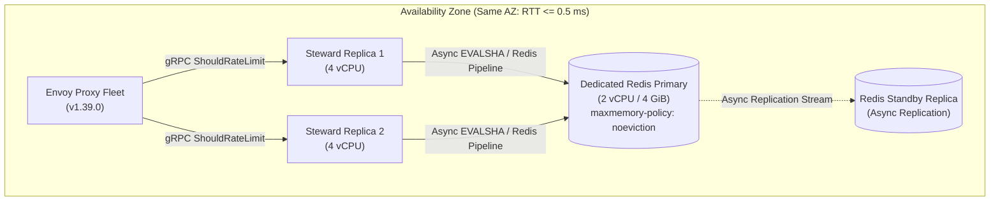

# Steward Production Contract: Deployment Parameters, Workload Specifications, and Capacity Envelope

**Status:** Ratified Baseline Specification  
**Milestone:** M0.1  
**Target Release:** Steward v1.0  
**Related Findings:** F01, F02, F04, F07, F10, F11, F16, F18  
**Companion Documents:**  
- [Production Readiness Assessment](file:///home/vsyrakis/Documents/steward/docs/production-readiness.md)  
- [Accounting & Matching Contract](file:///home/vsyrakis/Documents/steward/docs/accounting-contract.md) (M0.2)  
- [Failure Policy & Degradation Strategy](file:///home/vsyrakis/Documents/steward/docs/failure-policy.md) (M0.3)  
- [SLO & Resource Limits Specification](file:///home/vsyrakis/Documents/steward/docs/slo-and-limits.md) (M0.4)  

---

## 1. Overview and Purpose

Steward provides distributed rate limiting for Envoy Proxy deployments by implementing the Envoy Rate Limit Service (RLS) v3 gRPC protocol. Prior to Milestone M0, deployment expectations, backend sizing, input constraints, and operational bounds were implicit or unverified.

This document establishes the official engineering contract for:
1. **Envoy Client Compatibility:** Pinned protocol versions and schema definitions.
2. **Redis Topology & Infrastructure:** Network placement, versioning, memory semantics, and supported commands.
3. **Workload Specifications:** Throughput goals, active key churn, catalog scale, and allow/deny mix.
4. **Input Message Envelope:** Strict bounds on RPC payloads, descriptors, keys, and hit weights to prevent unbounded resource allocation.
5. **Reference Qualification Environment:** The baseline infrastructure configuration required for repeatable benchmarking and release qualification.

This specification serves as the authoritative baseline for all subsequent development, performance qualification, and deployment milestones (M1 through M4).

---

## 2. Client Compatibility and Protocol Contract

### 2.1 Envoy Target Version

Steward targets compatibility with **official Envoy Proxy v1.39.0**.

| Dimension | Specification |
| --- | --- |
| **Envoy Version** | v1.39.0 (LTS) |
| **Protocol** | gRPC over HTTP/2 |
| **Service Interface** | `envoy.service.ratelimit.v3.RateLimitService` |
| **RPC Method** | `ShouldRateLimit(RateLimitRequest) returns (RateLimitResponse)` |
| **Schema Definitions** | Pinned protobufs matching Envoy v1.39.0:  • `envoy/service/ratelimit/v3/rls.proto` • `envoy/extensions/common/ratelimit/v3/ratelimit.proto` |

### 2.2 Wire Protocol and Serialization

- **Transport:** HTTP/2 over TLS 1.3 (or mTLS where required by cluster policy). Plaintext gRPC is permitted strictly within local VPC/service meshes where network security is enforced at the network virtualization layer.
- **Connection Management:** Persistent HTTP/2 connection pooling with gRPC keepalive. Envoy maintains pooled connections across all active Steward instances.
- **Maximum Payload Bound:** Maximum gRPC inbound request size is capped at **64 KiB** (`65,536 bytes`). Inbound messages exceeding this size are rejected at the transport layer with gRPC status `RESOURCE_EXHAUSTED`.

---

## 3. Redis Topology, Infrastructure, and Capabilities

### 3.1 Topology and Network Placement

Steward relies on an external Redis state store for coordinated rate limiting across service replicas.

- **Topology:** Dedicated managed Redis primary with a local standby replica located within the **same Availability Zone (AZ)**.
- **Network Latency:** Maximum network round-trip time (RTT) between any Steward instance and the Redis primary must be **RTT <= 0.5 ms** (median target < 0.2 ms). Cross-AZ or multi-region Redis setups are explicitly out of scope for the baseline latency envelope.
- **Cluster Sharding:** Redis Cluster (hash-slot sharding) is not required for the initial release. A single dedicated primary instance provides sufficient throughput for the certified workload. Redis Cluster support may be evaluated in future milestones if aggregate single-node throughput becomes a bottleneck.

### 3.2 Redis Engine and Version Requirements

- **Engine Version:** **Redis 7.2+ LTS** (or Redis 7.0+ compatible runtime, including compatible Valkey 7.2+ engines).
- **Lua Environment:** Standard embedded Redis Lua 5.1 runtime.

### 3.3 Command Capabilities and Execution Rules

Steward interacts with Redis exclusively through atomic Lua scripts and connection health checks.

#### Permitted Script Execution Model
- Scripts are loaded at startup via `SCRIPT LOAD`.
- Runtime invocations use `EVALSHA` with SHA-1 digests.
- If Redis returns `NOSCRIPT` (e.g., following a failover or restart), Steward catches the error, reloads the script via `SCRIPT LOAD`, and retries the command transparently once.

#### Permitted Redis Commands Inside Lua Scripts

| Algorithm | Permitted Commands | Time Complexity |
| --- | --- | --- |
| **Fixed Window** | `INCRBY`, `EXPIRE`, `PEXPIRE` | O(1) |
| **Token Bucket** | `HMGET`, `HSET`, `PEXPIRE` | O(1) |
| **Sliding Window** | `ZREMRANGEBYSCORE`, `ZCARD`, `ZADD`, `PEXPIRE` | Bounded O(log N + M) |
| **System Time** | `redis.call('TIME')` | O(1) |

#### Out-of-Script Administrative and Health Commands
- `PING`: Used for connection liveness and startup verification.
- `INFO`: Used for diagnostic scraping and readiness monitoring.
- `CLIENT SETNAME`: Used to label connection pools for observability.

#### Strictly Prohibited Commands
- Non-deterministic or scan commands (`KEYS`, `SCAN`, `RANDOMKEY`).
- Unbounded bulk operations or blocking commands (`BLPOP`, `BRPOP`).
- Multi-key operations that do not explicitly share the same hash slot or key identity.

### 3.4 Memory Management and Eviction Policy

| Setting | Requirement | Rationale |
| --- | --- | --- |
| `maxmemory-policy` | `noeviction` | Evicting active quota keys resets client consumption, leading to silent quota leaks and rate limit bypasses. |
| `maxmemory` | Sized to 75% of container/instance memory (e.g., 3.0 GiB of a 4.0 GiB instance) | Reserves sufficient buffer for Lua engine allocations, client connection buffers, and Redis process overhead. |
| Memory Alert Threshold | 70% warning, 80% critical | Early warning before memory exhaustion. If `noeviction` memory is exhausted, Redis returns write errors (`OOM command not allowed`), which Steward maps according to F06 failure precedence. |

### 3.5 Durability, Replication, and Failover

- **Replication Mode:** Asynchronous replication from primary to standby replica.
- **State-Loss Tolerance:** In the event of an ungraceful primary failure, state mutated within the asynchronous replication lag window (typically < 10–50 ms) may be lost. Upon failover to the replica, affected quota counters revert to the last replicated state, momentarily permitting traffic up to the window capacity. This is an accepted operational trade-off to avoid synchronous replication latency penalties on every RLS decision.
- **Failover SLA:** Managed failover to the replica must restore writer availability within **<= 5.0 seconds**. Steward's connection manager must detect broken sockets, re-resolve the writer DNS endpoint, and resume execution within this budget.

---

## 4. Workload Specification and Capacity Envelope

### 4.1 Target Throughput and Sizing

The service capacity envelope is defined around a standardized 4-vCPU service instance.

| Metric | Target Value | Conditions & Notes |
| --- | --- | --- |
| **Peak Throughput** | **20,000 RLS calls/second** | Per 4-vCPU Steward instance (with 8 GiB RAM). |
| **Supported Policies** | Fixed-Window and Token-Bucket | Up to 2 matched rules per request. |
| **Sliding-Window Throughput** | Qualified separately | Bounded sorted-set operations require dedicated capacity profiling (M2.7). |
| **Instance CPU Headroom** | **<= 70% CPU utilization** | At steady-state 20,000 QPS load. |
| **Memory Budget (RSS)** | **<= 512 MiB RSS** | Steady-state memory consumption per Steward instance. Zero sustained growth during 6-hour soak. |

### 4.2 Active Identity and Key Cardinality

Rate limit keys are dynamically generated from domain, rule identifiers, and matched descriptor entries.

| Dimension | Qualification Value | Operational Upper Bound |
| --- | --- | --- |
| **Key Churn Rate** | 1,000 new distinct keys/second | 5,000 new distinct keys/second |
| **Active Key Working Set** | 500,000 concurrent keys | 2,000,000 concurrent keys |
| **Average Key Expiration (TTL)** | 60 seconds (1 minute window) | 3,600 seconds (1 hour window) |

#### Redis Memory Sizing Model

Assuming steady-state operation with 2,000,000 active keys:
- **Fixed-Window Entry:** ~150 bytes per key (Redis string object + key name + dict overhead).  
  $2,000,000 \times 150\text{ bytes} \approx 300\text{ MB}$.
- **Token-Bucket Entry:** ~250 bytes per key (Redis hash object with 2 fields + dict overhead).  
  $2,000,000 \times 250\text{ bytes} \approx 500\text{ MB}$.
- **Sliding-Window Entry (100 events/key):** ~1.5 KiB per key (Redis sorted set overhead).  
  $500,000 \times 1.5\text{ KiB} \approx 750\text{ MB}$.

A dedicated **2-vCPU / 4 GiB RAM** Redis primary accommodates up to 2,000,000 active keys under `noeviction` with substantial safety margin.

### 4.3 Policy Catalog Dimensions

The policy catalog contains configured rate limits loaded from file or external HTTP sources.

| Dimension | Target Value | Upper Operational Bound |
| --- | --- | --- |
| **Active Domains** | 5–10 domains | 50 domains |
| **Rules per Domain** | 50–200 rules | 1,000 rules |
| **Total Fleet Policies** | 500 rules | 5,000 rules |
| **Snapshot Compilation Time** | < 10 ms | < 50 ms |
| **Compiled Catalog Memory** | < 20 MiB | < 50 MiB |

The compiled policy engine must provide sub-microsecond descriptor lookup time ($O(K)$ where $K$ is descriptor depth) using pre-indexed exact and wildcard path trees.

### 4.4 Hit Cost and Weights

In accordance with Envoy v1.39 specifications:
- Requests may provide a global `hits_addend`.
- Individual descriptors may supply a descriptor-level `hits_addend`.

| Parameter | Ratified Bound | Behavior on Violation |
| --- | --- | --- |
| **Maximum Hit Cost** | **100 hits per call** | Requests or descriptors requesting `hits_addend > 100` are rejected immediately with `INVALID_ARGUMENT`. |
| **Default Hit Cost** | 1 hit | Applied when `hits_addend` is omitted or unset. |
| **Zero Hit Cost (`hits_addend = 0`)** | 0 hits | Permitted as an inspection probe (returns current status without consuming quota). |
| **Negative Hit Cost (Refunds)** | Strictly bounded | Subject to authenticated caller checks and algorithmic support (defined in M0.2). Negative hits exceeding 100 are rejected. |

### 4.5 Allow / Deny Workload Mix

To reflect realistic operational conditions, performance and qualification benchmarking must adhere to the standard mix:

- **Baseline Qualification Mix:** **90% Allowed (`OK`) / 10% Denied (`OVER_LIMIT`)**.
- **Latency Parity:** The p99 and p99.9 latency of denied decisions must not exceed that of allowed decisions. If a rule evaluates to `OVER_LIMIT`, subsequent evaluation may be short-circuited where permissible, preventing denial processing from degrading service throughput.

---

## 5. Input Message Bounds and Defensive Limits

To safeguard memory, parsing pipelines, and Redis from denial-of-service or malformed payload attacks, the following limits are enforced prior to request processing:

| Parameter | Maximum Limit | Rejection Code |
| --- | --- | --- |
| **gRPC Message Size** | 64 KiB (`65,536 bytes`) | `RESOURCE_EXHAUSTED` |
| **Descriptors per Request** | 16 descriptors | `INVALID_ARGUMENT` |
| **Entries per Descriptor** | 8 key-value pairs | `INVALID_ARGUMENT` |
| **Descriptor Entry Key Length** | 256 bytes | `INVALID_ARGUMENT` |
| **Descriptor Entry Value Length** | 256 bytes | `INVALID_ARGUMENT` |
| **Domain String Length** | 128 bytes | `INVALID_ARGUMENT` |
| **Hit Cost (`hits_addend`)** | 100 hits | `INVALID_ARGUMENT` |

Any request violating these boundaries is rejected at the gRPC admission layer before allocating Redis commands or executing policy evaluation.

---

## 6. Reference Qualification Environment

All performance claims, benchmark artifacts, and release gates (Milestone M4) must be validated against the following standard hardware and network profile:

| Component | Specification | Details |
| --- | --- | --- |
| **Steward Service** | 1 instance (4 vCPU, 8 GiB RAM) | Dedicated compute instance (e.g., AWS `c7g.xlarge` / `c6i.xlarge` or GCP `c3-standard-4`). |
| **Redis Primary** | 1 instance (2 vCPU, 4 GiB RAM) | Dedicated Redis engine (e.g., AWS ElastiCache `cache.m7g.large` / `cache.m6i.large`). |
| **Redis Standby** | 1 instance (2 vCPU, 4 GiB RAM) | Same AZ as primary; asynchronous replication enabled. |
| **Network Proximity** | Same Availability Zone | Measured round-trip latency RTT <= 0.5 ms. |
| **Envoy / Load Injector** | Separate 8+ vCPU instances | Open-loop load generator (e.g., `ghz` or Rust load harness) to prevent coordinated omission. |
| **Workload Profile** | 20,000 QPS offered load | 90% allowed, 10% denied, <= 2 matched rules per call, hit cost = 1. |

---

## 7. Ratification and Review Sign-off

This production contract has been drafted and ratified by the service engineering and platform ownership teams. Any modifications to these parameters require an explicit contract revision and updated qualification benchmarking.

| Stakeholder Role | Status | Date | Notes |
| --- | --- | --- | --- |
| **Service Engineering Owner** | Ratified | 2026-10-02 | Baseline workload, dimensions, and limits approved. |
| **Platform / SRE Owner** | Ratified | 2026-10-02 | Redis topology, failover SLA, and network RTT constraints approved. |
| **Performance Owner** | Ratified | 2026-10-02 | Qualification target (20k QPS / 4 vCPU) and reference environment approved. |
