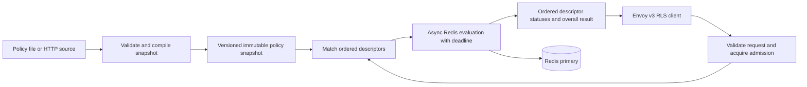

# Steward production readiness and performance assessment

**Reviewed:** 2 October 2026  
**Repository snapshot:** `742ffda` (`test: assert HTTP rate limit response`)  
**Target:** An Envoy v3 gRPC rate limit service with predictable latency, correct shared limits, and safe operation under load and dependency failures.

## Assessment

Steward provides a useful end-to-end foundation, but the reviewed version is not ready for production enforcement. The largest gaps are incorrect descriptor interpretation, ignored request fields, sliding-window correctness across replicas, unbounded Redis work, and allowing traffic before a valid policy snapshot is available. Performance and availability have not been established by measurements.

Prioritize correct decisions and bounded execution, then certify performance and operational behavior. Adding more service replicas or Redis connections alone will not resolve these problems.

This report covers all tracked application source, Lua scripts, configuration examples, containers, CI, and tests. It also checks the cached Envoy protobufs and locked dependency source for `redis` 1.7.1, `r2d2` 0.8.10, `tonic` 0.14.6, and `cadence` 1.8.0. Protocol expectations were checked against official Envoy v1.39.0 documentation, matching the repository's Envoy image and build configuration. Cached/generated files are supporting evidence rather than reproducible build inputs.

**Method and limits:** Static source review and documentation checks. Existing tests were read but not executed. No benchmarks, fault injection, container builds, or production telemetry were collected or examined. Findings describe code behavior and plausible failure mechanisms; performance targets below are proposed release criteria, not achieved results. Deployment infrastructure outside this repository may address some operational gaps, but no such evidence is present here.

## Existing foundation

- The service implements Envoy's v3 `ShouldRateLimit` endpoint using Tonic and Prost.
- All three algorithms perform each individual key update atomically in Redis Lua.
- Fixed-window enforcement allows the request that exactly reaches the configured limit.
- Configuration is distributed through a Tokio watch channel; failed reloads retain the previous snapshot.
- Redis keys separate domains and algorithms and use lengths to avoid ambiguous descriptor concatenation.
- HTTP configuration fetching checks HTTP status and has a ten-second timeout.
- StatsD submission uses a bounded queue, keeping network sends off the request thread.
- The repository commits `Cargo.lock` and has formatting, Clippy, unit, and Envoy integration checks in CI.

These are valuable pieces to retain while replacing the paths identified below.

## Goals and proposed release criteria

The production workload, quota strictness, failure policy, and deployment environment are unspecified. Use the following as an initial engineering contract and ratify it in milestone M0.

| Goal | Proposed measurable criterion | Qualification |
| --- | --- | --- |
| Correct decisions | Reference-model agreement for supported algorithms, descriptor matching, weighted hits, and overrides; no concurrency overshoot beyond each algorithm's documented burst behavior while Redis and configuration remain healthy. | Fixed-window boundary bursts are an algorithm property. Failover, policy changes, and failure-open bypasses need separate guarantees. |
| Enforcement availability | At least 99.99% of valid RLS calls receive a definitive decision within the configured deadline over a rolling 30 days. | Both `OK` and `OVER_LIMIT` count as successful decisions. Dependency errors and policy bypasses do not. Track downstream HTTP availability separately. |
| Decision latency | At declared supported load: p99 at most 5 ms and p99.9 at most 10 ms, measured from the Envoy/RLS client. | Include network, matching, admission, Redis, and serialization. Publish the latency of allowed and denied calls separately. |
| Throughput | Initial qualification target: 20,000 RLS calls/second per 4-vCPU service instance for fixed-window and token-bucket policies, with at most two matched rules per call. | A starting target to validate, not a capacity forecast. Sliding-window capacity must be reported separately. |
| Bounded resources | Service CPU below 70% at the supported steady load; RSS below a proposed 512 MiB budget; bounded admission and backend queues; no sustained memory growth in a six-hour soak. | Set Redis capacity independently. Count backend operations and accepted hit volume, not just RPCs. |
| Predictable failures | Overload and backend failure return within an internal 10 ms budget or the remaining client deadline, whichever is shorter. Explicit Envoy RPC timeout: initially 20 ms. | Reserve time for the response network path. Keepalive and TCP connect timeouts do not bound an RPC. |
| Safe policy lifecycle | No enforcement traffic before initial validation; invalid reloads leave the active version untouched; fleet policy-version divergence is visible and has a documented bound. | With the current 60-second polling interval and ten-second fetch timeout, healthy propagation can already exceed 60 seconds. |
| Recovery and rollout | Two or more service replicas; drain completes within the deployment termination grace period; controlled failover restores definitive decisions within a proposed five seconds. | During recovery, individual calls still obey their deadline. Measure lost quota state and explicitly accept the resulting allowance. |

For performance qualification, record service and Redis CPU/memory, Redis version and persistence settings, client count, network placement and RTT, TLS, policy size, key distribution, hit cost, and allow/deny mix. A candidate reference environment is a dedicated Redis primary with 2 vCPU/4 GiB in the same availability zone, measured RTT at most 0.5 ms, and a 90% allowed/10% denied workload. That environment is an experiment specification, not proof that the throughput target is attainable.

## Prioritized findings

**P0:** Blocks safe production enforcement.  
**P1:** Required before a general production release.  
**P2:** Follow-up simplification or optimization after correctness and bounded operation are established.

| ID | Priority | Problem | Main consequence | Milestone |
| --- | --- | --- | --- | --- |
| F01 | P0 | Descriptors are flattened into independent entry matches. | Wrong scope, missing tenant isolation, and no dynamic per-value policies. | M1 |
| F02 | P0 | Descriptor hit costs and refunds are ignored; malformed overrides remove checks. | Incorrect accounting and silent enforcement bypass. | M1 |
| F03 | P0 | Sliding-window IDs are process-local; client clocks control time. | Undercounting across replicas and incorrect expiry/refill. | M2 |
| F04 | P0 | Sliding-window work and numeric inputs are insufficiently bounded. | A single check can monopolize Redis. | M1, M2 |
| F05 | P0 | Startup serves an empty snapshot; policy validation happens during requests. | Traffic is admitted without intended limits. | M1 |
| F06 | P0 | Redis errors become successful allowed decisions. | Envoy cannot apply its configured backend-failure policy. | M1 |
| F07 | P0 | No application deadline or global admission bound. | Long-lived blocked work and overload amplification. | M2 |
| F08 | P1 | Synchronous Redis checks run sequentially with checkout `PING`s. | Extra round trips, blocked threads, and poor tail latency. | M2 |
| F09 | P1 | Responses omit descriptor statuses and limit details. | Incomplete RLS behavior and missing configured rate-limit headers. | M1, M2 |
| F10 | P1 | Limit settings are part of Redis state identity. | Quota resets and split enforcement during policy changes. | M1 |
| F11 | P1 | Algorithm and multi-rule accounting semantics are undocumented. | Different algorithms enforce different meanings of the same policy. | M0, M2 |
| F12 | P1 | Configuration fetching lacks resource and lifecycle controls. | Stale or oversized policies, unnecessary load, and invisible loader failure. | M1, M3 |
| F13 | P1 | Metrics cannot establish an enforcement SLO. | Hidden bypasses, slow calls, and expensive logging during overload. | M2, M3 |
| F14 | P1 | Secure transport and caller trust are not established. | Unauthorized quota consumption, refunds, or policy overrides. | M3 |
| F15 | P1 | No readiness service or graceful shutdown. | Startup bypasses and disrupted rolling deployments. | M1, M3 |
| F16 | P1 | Redis topology, state durability, and memory policy are unspecified. | Single dependency failure, lost quotas, and capacity exhaustion. | M3 |
| F17 | P1 | Builds fetch mutable protobufs; the container runs a debug binary. | Non-reproducible releases and avoidable runtime cost. | M1, M3 |
| F18 | P1 | Tests and benchmarks do not cover production behavior. | Correctness, resilience, and performance claims lack evidence. | M1–M4 |

### F01 — Preserve complete descriptor meaning

**Evidence:** [src/service.rs](../src/service.rs#L169), lines 169–194; [src/rate_limits.rs](../src/rate_limits.rs#L5), lines 5–10.

`matching_rate_limits` iterates through every entry and matches each against a flat configured `key/value`. It never matches an ordered descriptor as a unit. A descriptor such as `[(tenant, acme), (route, /payments)]` can therefore consume a global `/payments` counter instead of a counter scoped to Acme's payments traffic. Order and parent context are discarded.

Every configured value must also equal the request value. There is no policy meaning “match any client ID, but maintain a separate counter for each actual client.” The example Envoy sends a `remote_address` descriptor, but the mock policy configures no corresponding rule, so that action provides no IP protection. Likewise, the `disallow_spammy_GETs` action has no policy in the mock source.

**Recommendation:** Replace the flat policy schema with rules that match complete ordered entry paths. Compile an index once on reload. Support explicit exact values and explicit wildcard values, with deterministic exact-match precedence; include actual matched dynamic values in the counter identity. Keep multiple time limits on one descriptor possible, since the current example uses both second and minute limits. Preserve each input descriptor's position through evaluation and response assembly. Remove the obsolete flat matcher and schema instead of retaining a second interpretation.

Envoy defines descriptors as hierarchical entry lists and requests evaluation across all supplied descriptors. [Envoy v1.39 RLS contract](https://www.envoyproxy.io/docs/envoy/v1.39.0/api-v3/service/ratelimit/v3/rls.proto), [common descriptor contract](https://www.envoyproxy.io/docs/envoy/v1.39.0/api-v3/extensions/common/ratelimit/v3/ratelimit.proto).

**Acceptance:** Tests distinguish tenant/route combinations, entry order, exact and wildcard rules, unmatched descriptors, multiple policies, and duplicate input descriptors. The Envoy example demonstrates a real dynamic per-client counter.

### F02 — Respect hit fields and reject invalid policy inputs

**Evidence:** [src/service.rs](../src/service.rs#L175), lines 175–190 and 219–226; [src/rate_limits.rs](../src/rate_limits.rs#L119), lines 119–129.

The service uses only `request.hits_addend.max(1)` and applies that same cost to every matched rule. Envoy v1.39 descriptors also have an optional `UInt64Value hits_addend` and `is_negative_hits`; both exist in the generated types and are ignored. A descriptor cost of 100 is charged as one when the request cost is unset, and a refund is treated as a positive charge. These are protocol behavior gaps, not merely optional tuning features. [Envoy v1.39 descriptor hit fields](https://www.envoyproxy.io/docs/envoy/v1.39.0/api-v3/extensions/common/ratelimit/v3/ratelimit.proto).

An override with zero capacity or an unknown unit produces an invalid `RateLimit`, which is skipped. If no other rule matches, the response is allowed. Empty domains, empty descriptors, empty keys, and excessive string lengths receive no application validation. Protobuf decoding does not itself enforce the imported validation annotations.

**Recommendation:** Compute cost separately for each descriptor, preserving optional-field presence and validating conversion from `u64`. Define zero-cost behavior. Implement supported refunds with explicit authorization and capacity bounds; reject unsupported algorithm/refund combinations explicitly. Reject malformed overrides before evaluation rather than deleting the matched protection. Validate request shape and limits before allocating keys or issuing Redis commands. Bound override values and trust their source.

**Acceptance:** Contract cases cover request/descriptor cost precedence, zero and maximum costs, overflow, refunds, invalid units, invalid overrides, and malformed messages. None silently becomes an ordinary successful allow.

### F03 — Make sliding-window events unique and use authoritative time

**Evidence:** [src/service.rs](../src/service.rs#L25), line 25, lines 108–135 and 162–166; [sliding_window.lua](../src/scripts/sliding_window.lua#L7), lines 7–14; [token_bucket.lua](../src/scripts/token_bucket.lua#L10), lines 10–24.

Sliding-window members use a timestamp and a process-local counter. Two replicas with the same counter value checking the same key in the same millisecond can emit the same member. `ZADD` then updates an existing event instead of recording another hit. The script nevertheless reports `current + hits`, so its immediate result can conceal the lost event; subsequent calls see a smaller set and admit extra traffic. Restarting resets the counter as well.

Both sliding and token algorithms trust the application's wall clock. A fast replica can remove events early. Token refill clamps negative elapsed time to zero but still writes the earlier timestamp; alternating fast and slow clocks can repeatedly refill the same apparent interval.

**Recommendation:** Use Redis server time inside the scripts and clamp stored token timestamps against backward movement. Replace the sliding member allocator with an identity mechanism that is unique across replicas and restarts. For example, maintain an atomic sequence in Redis with an explicit key lifecycle, then combine the sequence with event identity; alternatively use an established unique-ID library. Keep any additional keys in the same Redis Cluster slot and bounded lifecycle. Choose one implementation and remove the old nonce path.

**Acceptance:** Deterministic tests force matching timestamps across two replicas and a restart, then verify actual Redis cardinality. Clock-regression tests verify no repeated refill or early event deletion; failover tests account for Redis-host clock changes.

### F04 — Bound script work, state size, and numeric ranges

**Evidence:** [sliding_window.lua](../src/scripts/sliding_window.lua#L7), lines 7–18; [src/service.rs](../src/service.rs#L108), lines 108–134; [src/rate_limits.rs](../src/rate_limits.rs#L12), lines 12–18 and 119–121.

Sliding-window Lua creates one sorted-set member for each accepted hit. A request-level cost can reach `u32::MAX`, and configured capacity is any positive `i64`. If capacity permits the request, the loop can attempt billions of writes. Expiry pruning can also remove a large event backlog in one script. Redis executes scripts atomically while blocking other activity, so these costs affect unrelated limits sharing the server. [Redis Lua execution model](https://redis.io/docs/latest/develop/programmability/eval-intro/).

Memory grows with retained accepted hits, rather than just active identities. Continuous denied traffic refreshes a sliding key's TTL, even after its events are pruned. Unrestricted capacity also enters Lua/floating-point arithmetic; values beyond exact numeric ranges can lose precision. The response protocol's capacity field is `uint32`, narrower than the configuration's `i64`.

**Recommendation:** Validate capacity against the wire representation and algorithm limits at policy load. Set hard application bounds on descriptors, entries, bytes, hit cost, and sliding events per window. Measure worst-case pruning as well as insertion. Restrict the exact sliding log to workloads that fit its budget; if exact logs are unnecessary, replace it with a documented bounded-state algorithm, acknowledging the changed semantics. Keep fixed-window and token-bucket policies constant in state size per key.

Candidate starting request bounds are 64 KiB encoded messages, 16 descriptors, eight entries per descriptor, and 256 bytes per entry key/value. For exact sliding windows, start qualification with at most 100 hits per call and 10,000 retained events per key; lower these if measured script latency violates the budget. These are proposed contract limits, not universally safe values.

**Acceptance:** Over-bound inputs are rejected before Redis. Maximum allowed insertion and pruning complete within an agreed script budget, initially p99 below 1 ms on the qualification Redis host. State and key-count budgets are measurable.

### F05 — Load and validate configuration before serving enforcement traffic

**Evidence:** [src/main.rs](../src/main.rs#L28), lines 28–45 and 68–91; [src/config_source.rs](../src/config_source.rs#L20), lines 20–45; [src/service.rs](../src/service.rs#L220), lines 220–223.

The watch channel starts with an empty map, and configuration loads in a detached task. The server can become reachable before the first fetch completes. During that interval, every domain is unconfigured and gets `OK`. If initial fetches continually fail, this state can persist indefinitely.

Loading checks deserialization, not policy validity. Zero/negative capacities and `Unknown` units can become active and are ignored later during matching. An accidental empty document can replace a valid snapshot. Duplicate or ambiguous policies are not validated. This turns configuration mistakes into enforcement changes during live requests.

**Recommendation:** Fetch, fully validate, and compile the initial snapshot before publishing readiness. Fail startup or remain explicitly not ready when that cannot complete within a startup budget. Publish reloads only after whole-snapshot validation and compilation. Validate settings too: reject zero or excessive limits instead of silently clamping them or narrowing `usize` to `u32`. Treat an intentional empty policy set as an explicit deployment decision. Give each snapshot a stable content digest/version and load timestamp.

Retaining a validated active snapshot on a transient reload failure is operational resilience, not a legacy configuration compatibility path.

**Acceptance:** Startup source failures never yield readiness or normal enforcement `OK`s. Invalid reloads preserve both the active version and decisions. An unmatched domain after a valid load has separately documented behavior and metrics.

### F06 — Expose backend failures to Envoy

**Evidence:** [src/service.rs](../src/service.rs#L144), lines 144–155 and 244–253; [containers/envoy.yaml](../containers/envoy.yaml#L89), lines 89–97.

Every Redis error becomes `allowed: true, observed: 0`. The service returns a successful RLS response and counts the request as allowed. Setting Envoy's `failure_mode_deny` to true cannot reject these hidden backend errors, because Envoy received a successful decision. The example independently enables failure-open behavior at Envoy.

**Recommendation:** Return `Unavailable` for backend failures and `DeadlineExceeded` for exhausted time budgets when no definitive rejection is available. Let the deployment's explicit Envoy failure policy govern those cases. Use this precedence: a definitive known quota rejection wins; otherwise an unresolved backend check is an RPC error. Record partial updates and errors independently. Do not disguise dependency failure as a quota rejection or as a healthy allow.

Envoy applies `failure_mode_deny` to service call errors; this policy requires observable RPC errors. [Envoy rate limit filter behavior](https://www.envoyproxy.io/docs/envoy/latest/configuration/http/http_filters/rate_limit_filter).

**Acceptance:** Kill Redis, inject authentication errors, exhaust memory, and delay responses. Verify Envoy's selected failure-open and failure-closed configurations, service error metrics, and downstream status codes. A successful allow metric is not incremented for an unresolved check.

### F07 — Enforce deadlines and global admission limits

**Evidence:** [src/main.rs](../src/main.rs#L58), lines 58–64; [src/service.rs](../src/service.rs#L81), lines 81–88 and 229–242.

The application sets transport keepalives but no request-handler timeout, global concurrency limit, or overload rejection. The Redis pool's default checkout timeout is 30 seconds, with validation enabled. Redis connections are created without explicit connection/read/write deadlines. A blocked synchronous call inside `block_in_place` cannot be preempted by an async timeout while that handler is not yielding. An Envoy timeout can therefore leave work consuming service resources and updating quota after the caller has stopped waiting.

The example omits the rate limit filter timeout, so Envoy v1.39 uses its 20 ms default. Its 10 ms cluster connect timeout applies to connection establishment, not the whole check. [Envoy v1.39 filter source](https://raw.githubusercontent.com/envoyproxy/envoy/v1.39.0/api/envoy/extensions/filters/http/ratelimit/v3/rate_limit.proto), [r2d2 checkout defaults](https://docs.rs/r2d2/0.8.10/r2d2/struct.Builder.html).

**Recommendation:** Use a fully async backend and enforce the smaller of an internal budget and the client deadline. Cover admission, connection establishment, backend queueing, reconnect waits, script loading, and evaluation. Add a service-wide bounded semaphore with immediate or tightly bounded admission; per-connection limits alone allow many clients to exceed the total budget. Use Tonic's transport limits and load shedding in addition to that global bound. [Tonic server controls](https://docs.rs/tonic/latest/tonic/transport/struct.Server.html).

Cancellation prevents further application work, but cannot revoke a Redis mutation already sent. Treat that as an ambiguous execution outcome; do not blindly retry a quota mutation after a timeout. The Redis client's cancellation-safe future does not cancel an already transmitted command. [Redis multiplexed connection semantics](https://docs.rs/redis/latest/redis/aio/struct.MultiplexedConnection.html).

**Acceptance:** At twice supported load, memory and queued work remain bounded, excess calls are promptly rejected, and accepted calls respect their budget. A backend blackhole does not produce lasting thread growth. Timeout tests check both returned status and possible quota side effects.

### F08 — Replace synchronous pool usage and avoid sequential round trips

**Evidence:** [Cargo.toml](../Cargo.toml#L20), lines 20–22; [src/service.rs](../src/service.rs#L66), lines 66–71, 81–101, and 229–242.

Redis scripts execute synchronously inside `tokio::task::block_in_place`, one matched rule after another. Every rule checks out its own pool connection. Inspection of locked dependency source shows that `r2d2` enables checkout validation by default and `redis` implements that validation with `PING`. A healthy, warm-script request with N rules therefore performs approximately N validation round trips plus N evaluation round trips, serially. Pool contention and cold scripts add more cost.

As a rough network-only model, latency is at least about `2 × N × Redis RTT`, before matching, queueing, script work, and response delivery. This is an analytical estimate, not a benchmark. More pool connections improve concurrent utilization but do not remove per-call serialization.

**Recommendation:** Enable the existing Redis crate's `tokio-comp` and `connection-manager` features, then remove `r2d2`, synchronous invocation, and `block_in_place` from the service. Start with a shared async connection manager and bounded concurrency. Use bounded concurrent calls or measured pipelining for independent keys. Preserve descriptor association and accounting. Avoid inventing a pool: the library already provides multiplexing and reconnection. Add more connections only when measurements identify connection-level contention. [Redis client async and pooling guidance](https://github.com/redis-rs/redis-rs#connection-pooling).

Construct immutable `redis::Script` objects once: `Script::new` currently copies and hashes the script for every check. The library already uses `EVALSHA` and reloads missing scripts; it does not transmit the full Lua body on every healthy evaluation. Any new pipeline needs its own tested `NOSCRIPT` handling because individual `Script::invoke_async` behavior cannot simply be assumed for a pipeline. [Redis Script API](https://docs.rs/redis/latest/redis/struct.Script.html).

**Acceptance:** Profiling shows no blocking network calls in request handling, no per-rule checkout `PING`, and no per-request script hashing. Publish one-, two-, and sixteen-rule latency and operation-count results, including cold scripts and reconnects.

### F09 — Return useful and ordered descriptor statuses

**Evidence:** [src/response.rs](../src/response.rs#L4), lines 4–17; [containers/envoy.yaml](../containers/envoy.yaml#L97), line 97.

Every response has an empty `statuses` list. The service reports only the overall decision and cannot identify a descriptor's limit, remaining budget, or reset duration. The example enables `X-RateLimit` headers, but the service supplies none of the status data Envoy uses to generate them.

**Recommendation:** Produce one ordered status per input descriptor, including explicit unmatched behavior. Have algorithms return typed decision data: allow/deny, remaining capacity, and documented reset/recovery timing. Aggregate multiple matched policies deterministically into the descriptor's representative status and overall result. Keep the represented limit, remaining value, and reset duration consistent with the selected rule. Calculate retry timing separately when it differs from reset timing, and add a response `Retry-After` header if required for the pinned Envoy version.

The status list's correspondence to descriptors and its fields are part of the RLS contract. [Envoy v1.39 response contract](https://www.envoyproxy.io/docs/envoy/v1.39.0/api-v3/service/ratelimit/v3/rls.proto). Header inputs are specified in the pinned filter source. [Envoy v1.39 header configuration](https://raw.githubusercontent.com/envoyproxy/envoy/v1.39.0/api/envoy/extensions/filters/http/ratelimit/v3/rate_limit.proto).

**Acceptance:** Direct gRPC assertions check list length, order, limits, remaining capacity, and timing for matched, unmatched, and multiple-policy descriptors. Envoy assertions verify the enabled headers and 429 behavior.

### F10 — Define counter identity independently of mutable thresholds

**Evidence:** [src/service.rs](../src/service.rs#L197), lines 197–209 and 190; [src/main.rs](../src/main.rs#L76), lines 76–90.

Redis keys include capacity, unit, and algorithm. Changing a threshold creates a new counter with fresh budget. During the polling interval, old and new replicas can use separate counters for the same traffic. Reverting a policy can reconnect to an old key that remains alive. Different override values similarly create different counters. The map also deduplicates identical resulting keys, losing original descriptor association and potentially distinct accounting intent.

**Recommendation:** Specify a stable policy ID and canonical descriptor identity. For threshold-only edits, retain the counter and apply the new threshold; reconcile token capacity in the script. Treat window or algorithm changes as explicit new state identities with documented reset behavior. Document whether trusted overrides share consumption for the same identity or intentionally define separate budgets. Do not include a whole configuration version in every counter key: that would reset unrelated quotas on every edit. Use versioning for incompatible state schemas, and remove obsolete state-writing paths without migration layers.

**Acceptance:** Increasing/decreasing capacity, changing algorithms, reverting a policy, applying overrides, and rolling between two policy versions have documented results verified across multiple replicas. Duplicate descriptors follow one explicit accounting rule while retaining separate response positions.

### F11 — Document the actual algorithm and accounting contract

**Evidence:** [fixed_window.lua](../src/scripts/fixed_window.lua#L1), lines 1–5; [token_bucket.lua](../src/scripts/token_bucket.lua#L17), lines 17–24; [sliding_window.lua](../src/scripts/sliding_window.lua#L10), lines 10–18; [README.md](../README.md#L127), lines 127–130.

Fixed-window state expires a configured interval after the first hit; it is not aligned to calendar boundaries. It increments even for denied calls. Token buckets and sliding logs consume only allowed hits. Token capacity and refill rate are coupled through `requests_per_unit`. A request denied by one rule can still consume another rule's budget, and there is no transaction covering the entire descriptor set.

None of those choices automatically violates the RLS overall-decision contract, but they matter to users and must be intentional. A fixed window can admit nearly twice its configured amount across a window boundary. “Atomic updates” currently means each key, not all rules in the RPC.

**Recommendation:** Define anchored versus aligned windows, admission versus attempt counting, weighted costs, refund support, reset timing, duplicate handling, and multi-rule partial consumption. Initially retain independent per-rule updates with no cross-key rollback; this keeps the design compatible with sharded Redis and makes ambiguous timeout outcomes manageable. Explain this behavior publicly. Expose separate token burst capacity only if the product requires it, and implement it directly in the policy rather than using an accidental workaround.

**Acceptance:** Each advertised algorithm has a reference model and boundary/concurrency tests. Product documentation states its guarantees and limitations. Policies whose requirements exceed those guarantees cannot be silently configured.

### F12 — Control configuration size, freshness, and loader health

**Evidence:** [src/config_source.rs](../src/config_source.rs#L8), lines 8–45; [src/main.rs](../src/main.rs#L68), lines 68–92.

HTTP refresh creates a new client each time, does not cap response bytes or policy counts, and has no conditional fetch. The file path reads/parses synchronously inside an async task. All replicas use the same refresh interval without jitter. The loader's task handle is discarded, and there is no last-success timestamp or stale-policy signal. Fetch errors preserve prior policy indefinitely without visibility into its age.

**Recommendation:** Reuse one HTTP client, bound bytes and policy dimensions, and compile policies outside the request path. Move file reads and expensive compilation off Tokio workers where necessary. Add jitter to polling, use conditional fetches when the source supports them, and supervise the loader. Export source/version/age/last-error state. Choose a policy on stale snapshots: continue the validated snapshot with alerts, or stop readiness after an explicitly required maximum age. Do not introduce a second configuration distribution system unless polling cannot meet the actual propagation requirement.

**Acceptance:** Oversized, slow, malformed, and unavailable sources leave the active snapshot intact. Loader failure is visible. Memory during a reload is bounded despite holding old and new snapshots. Fleet version convergence is measured.

### F13 — Measure decisions, bypasses, and bottlenecks without log amplification

**Evidence:** [src/metrics.rs](../src/metrics.rs#L11), lines 11–40; [src/service.rs](../src/service.rs#L218), lines 218–253.

Existing counters are useful but omit total RPC latency, in-flight calls, admission rejection, unmatched descriptors, configuration age/version, and backend timeout classification. `rate_limit.observed` is a single gauge shared by every policy; fixed/sliding values represent consumption while token values represent remaining tokens. It is not a meaningful fleet utilization gauge. Early unconfigured-domain responses also use a different outcome path.

Every normal decision logs at INFO and every denial at WARN when enabled; the Compose example enables INFO. Redis failures log raw counter keys containing domain and descriptor values. At high request or denial rates, serialization and output can become substantial work and expose identifiers. Metric queue-full errors also log individually. Inspection of Cadence shows that background UDP send errors are discarded unless an error handler is configured; the current sink omits one.

**Recommendation:** Add request/Redis latency histograms or properly aggregated timers, outcome/error counters, in-flight/admission metrics, config freshness, and backend connection/queue health. Use bounded configured policy labels; never use dynamic IPs, client IDs, raw Redis keys, or arbitrary request domains as metric labels. Define backend histograms separately from admission time. Sample normal decisions, treat routine denials as metrics, and rate-limit repeated error logs. Track queue drops and sink errors through Cadence's existing builder and queue statistics; use its buffered UDP sink if measured packet overhead justifies it.

**Acceptance:** Dashboards and alerts compute the stated enforcement SLO, distinguish configured allows from bypasses, and expose overload and stale configuration. Metrics loss or logging backpressure cannot materially change request latency.

### F14 — Establish secure transports and trusted callers

**Evidence:** [src/service.rs](../src/service.rs#L66), line 66; [src/main.rs](../src/main.rs#L58), lines 58–64; [Cargo.toml](../Cargo.toml#L11), lines 11 and 21; [docker-compose.yml](../docker-compose.yml#L7), lines 7, 22–23 and 34–37; [containers/envoy.yaml](../containers/envoy.yaml#L130), lines 130–135.

The application listener has no TLS or caller authentication. Redis is always constructed with `redis://`, and its enabled features do not supply TLS. `redis_host` can contain URL user information, so password authentication is potentially expressible, but there is no clear credential/secret contract and a complete `rediss://` URL cannot be supplied as-is. The local environment publishes Redis and Envoy's admin interface to the host; Envoy runs with UID zero.

**Recommendation:** Accept one complete Redis URL with validated TLS configuration and secrets supplied by the deployment, then remove the host-prefix construction. Authenticate Envoy callers through native mTLS or one explicitly documented, enforced mesh/sidecar boundary. Restrict network access to the RLS and config source. Keep Envoy admin and Redis private in production. Only trusted policy producers may create overrides or refund hits; caller identity and trusted metadata must be established before accepting them. Protect configuration integrity and avoid exposing credentials in diagnostics.

The existing Redis client supports TLS and asynchronous connections through features; use those capabilities instead of custom networking. [Redis client TLS support](https://github.com/redis-rs/redis-rs#tls-support).

**Acceptance:** Unauthorized callers cannot consume or refill quotas, invalid certificates fail, Redis credentials can rotate through the selected deployment mechanism, and production manifests expose only intended listeners.

### F15 — Add readiness and bounded graceful shutdown

**Evidence:** [src/main.rs](../src/main.rs#L58), lines 58–65 and 74–92; [docker-compose.yml](../docker-compose.yml), all services.

There is no gRPC health service, readiness endpoint, shutdown signal handling, drain protocol, or deployment healthcheck. The configuration task is detached. Tokio's `signal` feature is enabled but unused. Process termination can interrupt requests, and a running process says nothing about initial configuration or its ability to enforce limits.

**Recommendation:** Add the established `tonic-health` service or the deployment's required equivalent. Make readiness depend on a validated snapshot and the declared backend-failure policy; keep liveness tied to process progress so a Redis outage does not trigger an endless restart cycle. On SIGTERM, stop readiness, stop new work, drain accepted requests within a fixed bound using Tonic's shutdown API, stop supervised background tasks, and flush telemetry within the remaining grace period. Bound all stages.

**Acceptance:** A rolling restart under load meets the error budget. A Redis outage does not induce restart storms. Initial source failure is not ready. Shutdown finishes before the deployment forcibly kills the container.

### F16 — Declare a Redis availability, durability, and memory contract

**Evidence:** [src/service.rs](../src/service.rs#L66), lines 66–71; [docker-compose.yml](../docker-compose.yml#L33), lines 33–38.

The client addresses one ordinary Redis endpoint; there is no selected managed-primary, Sentinel, or Cluster operational contract. Compose uses an unpinned Redis image without declared replication, persistence, memory limit, or eviction policy. More service replicas still share this bottleneck. A hot global key remains bound to one Redis primary/shard, regardless of total shard count.

Wildcard client policies will increase key cardinality. Evicting a quota key resets its budget; refusing writes at memory exhaustion produces errors that must follow F06. Long units and frequent rejected calls can retain state for substantial periods. Redis asynchronous replication can lose acknowledged mutations on failover, so shared atomic updates do not establish strict quota continuity across failures. [Redis replication guarantees](https://redis.io/docs/latest/operate/oss_and_stack/management/replication/).

**Recommendation:** For the first production deployment, select a managed Redis primary with replica failover and a stable writer endpoint, then qualify the client's reconnect behavior. Define acceptable quota-state loss and failover recovery. Set an explicit memory/eviction policy, ideally dedicated `noeviction` storage when silent quota reset is unacceptable; reserve headroom and alert before exhaustion. Estimate active keys as approximately new distinct identities/second multiplied by retention time, then include overhead, replication, persistence, and sliding events.

Add Redis Cluster only if measured aggregate key load requires sharding. Use the existing cluster client if selected, route writes to primaries, and ensure auxiliary script keys share a slot. Do not put every tenant or domain into one broad hash tag. Cluster does not remove a single hot counter's limit, and arbitrary cross-descriptor atomic transactions do not fit its slot rules. [Redis Cluster key and slot behavior](https://redis.io/docs/latest/operate/oss_and_stack/reference/cluster-spec/).

**Acceptance:** Publish supported topology and versions, recovery timings, lost-state bounds, key/memory sizing, and hot-key capacity. Exercise primary failover, reconnect, `NOSCRIPT`, memory exhaustion, and a sustained high-cardinality workload.

### F17 — Make release inputs reproducible and run an optimized image

**Evidence:** [build.rs](../build.rs#L18), lines 18–62, 65–81 and 95–120; [containers/Dockerfile](../containers/Dockerfile#L1), lines 1–24; [rust-toolchain.toml](../rust-toolchain.toml); [.github/workflows/ci.yml](../.github/workflows/ci.yml#L24), lines 24–45 and 53–62; [Cargo.toml](../Cargo.toml#L46), lines 46–52.

The build downloads protobuf archives, including mutable Google APIs `master` and xDS `main`, into an ignored `proto` directory. Downloads lack checksums and HTTP status validation. Cache markers use only repository names, so changing a source revision can retain stale cached input. `cargo --locked` pins Rust packages, not these schemas or the system `protoc`. Clean and cached builds can therefore compile different protocol inputs.

The application image includes the Rust toolchain, compiler tools, source, and a debug executable, and has no configured non-root user. Redis/httpbin images and Python mock dependencies are floating. CI's requested toolchain is `stable`, while the repository and image specify Rust 1.88; the effective compiler identity should be explicit. No release image or security/dependency qualification job is present. The zip build dependency is a prerelease, which needs a deliberate justification or replacement.

**Recommendation:** Vendor only the required pinned protobuf closure, with upstream revisions/licenses recorded, and make build-time code generation local and deterministic. Remove network download/cache-marker machinery and its now-unused dependencies. Pin codegen/protoc and use the repository toolchain consistently. Build a multi-stage release image running the optimized binary as a non-root user, with only required runtime libraries and CA roots. Pin deploy/test image versions or digests, and qualify the actual release artifact in CI. Add dependency/image scanning and an SBOM with a documented exception process; do not infer present vulnerabilities from the dependency list alone.

**Acceptance:** Fresh builds use identical reviewed schema inputs and work without schema-network access. CI records compiler/codegen/image identities and validates the release image. Release performance measurements use that exact artifact.

### F18 — Replace the smoke-test boundary with an evidence-based release gate

**Evidence:** [tests/rate_limit.rs](../tests/rate_limit.rs#L8), lines 8–38; [src/service.rs](../src/service.rs#L257), lines 257–284; [src/rate_limits.rs](../src/rate_limits.rs#L133), lines 133–156; [.github/workflows/ci.yml](../.github/workflows/ci.yml#L38), lines 38–62.

The repository has three unit tests and one Envoy HTTP integration test. Unit coverage checks a key collision, default algorithm parsing, and a validity helper. The integration test waits for an HTTP success and then checks that one of 30 requests gets a 429. It does not establish exact quota boundaries, which rule denied the call, configuration readiness, expiry, response headers, or backend failure policy. Its clients have no explicit per-request timeout, so the nominal readiness loop deadline does not strictly bound a stalled HTTP request.

Token buckets, sliding windows, weighted hits, descriptor hierarchy, multiple replicas, clock changes, reload behavior, shutdown, backend outages, and script-cache loss have no execution coverage in the tracked tests. There is no load harness, baseline, profile, capacity model, or soak result.

**Recommendation:** Add a layered qualification suite: pure matching/reference-model cases; direct gRPC cases against isolated Redis state; pinned Envoy integration; and separately scheduled load/fault/soak scenarios. Make dependencies ready explicitly and give every client a timeout. Isolate keys and environments so prior state cannot determine the outcome. Measure open-loop offered load as well as completed throughput to expose queue buildup and avoid coordinated omission. Benchmark the Rust service directly and the Envoy path separately.

**Acceptance:** The test and performance matrix below produces reproducible artifacts. CI covers deterministic correctness and a short integration gate; longer performance and recovery qualification run on controlled hardware before release.

## Recommended implementation shape

Use four concrete modules around the existing protocol/runtime code. Keep the current dependencies where they already provide the needed capabilities.

1. **Policy:** Fetch, validate, compile, and publish `Arc<CompiledConfig>` through the existing watch channel. Keep a short snapshot borrow and clone the `Arc`, rather than cloning the domain's entire descriptor vector on every call. A compiled map for exact paths plus explicit wildcard precedence is sufficient; introduce a trie only if policy shape or measurements require it.
2. **Matching/accounting:** Produce an ordered evaluation plan containing input descriptor index, policy ID, canonical counter key, validated cost, and algorithm. Retain the association even if shared counter work is deliberately deduplicated. Define duplicate charging in the contract.
3. **Redis:** Own the async manager, immutable scripts, connection/operation budgets, and typed outcomes. Use per-key atomic scripts, bounded work, and no generic multi-backend framework. Prefer a typed tuple/struct result to unchecked variable-length arrays: current short script responses silently default missing fields to zero.
4. **RPC/runtime:** Own request limits, global admission, error mapping, status assembly, readiness, shutdown, and telemetry. Keep transport settings separate from quota policy semantics.

Keep policy version observable but outside ordinary counter identity. Replace the obsolete synchronous and flat-policy paths once the new path works end to end. Do not add compatibility adapters, alternate backends, local quota caching, or cross-key rollback to the initial design.

## Milestones and tasks

Milestones are dependency ordered. Each should leave a deployable development product and a demonstrable capability. Completion is determined by exit criteria, not by a calendar estimate. Suggested owners are roles, not assumed staffing.

| Milestone | Goal | Depends on | Exit criterion | Suggested owners |
| --- | --- | --- | --- | --- |
| M0 — Contract and qualification plan | Make supported behavior and production targets explicit. | None | Approved behavior matrix, workload specification, and release gates. | Service owner, Envoy/platform owner |
| M1 — Correct fixed-window service | Establish a validated, useful Envoy integration. | M0 | Correct matching/accounting/statuses; no startup or invalid-policy bypass; explicit backend errors; deterministic fixed-window Envoy tests. | Service engineer |
| M2 — Bounded async execution and algorithm certification | Keep decisions correct and resource use predictable under load. | M1 | Async Redis, deadlines/admission, certified token/sliding behavior, and benchmark artifacts. | Service engineer, performance owner |
| M3 — Production operations | Make deployment, failures, and rollouts observable and recoverable. | M2 | Optimized secure artifact; readiness/drain; Redis HA and failure policy qualified; dashboards and runbooks. | Platform/SRE, service engineer |
| M4 — Release qualification | Demonstrate that the integrated service meets its declared envelope. | M3 | Correctness, overload, failover, soak, and canary gates pass on the production artifact. | Service owner, platform/SRE |

### M0 tasks — Define the production contract

- [ ] **M0.1:** Record supported Envoy version(s), Redis version/topology, initial region/AZ placement, request volume, active identities, policy count, descriptor depth, and maximum hit cost.
- [ ] **M0.2:** Specify ordered matching, exact/wildcard precedence, unmatched behavior, multiple limits, duplicate charging, override identity, refunds, window boundaries, and partial consumption. Map to F01, F02, F10, and F11.
- [ ] **M0.3:** Select failure-open or failure-closed behavior for the deployment and declare allowed bypass/state-loss exposure. Adopt the F06 failure precedence and define stale-config readiness.
- [ ] **M0.4:** Ratify or revise the proposed SLOs, input/resource limits, and benchmark environment. Decide whether exact sliding logs and separate token burst capacity are actual requirements.

**Deliverable:** A short behavior contract and a qualification matrix with explicit expected outcomes. Proposed defaults in this report are replaced by the chosen values before release.

### M1 tasks — Deliver correct fixed-window enforcement

- [ ] **M1.1:** Replace mutable remote schema downloads with a pinned, reviewed local protobuf closure; record provenance and pin codegen inputs. This gives subsequent protocol work a deterministic foundation.
- [ ] **M1.2:** Replace the flat configuration/matcher with complete ordered rules, exact/wildcard behavior, and multiple limits per descriptor. Update HTTP/file fixtures and Envoy examples together.
- [ ] **M1.3:** Validate settings and entire policy snapshots; compile before activation; complete initial load before readiness; expose version and last-success state.
- [ ] **M1.4:** Validate request dimensions, compute descriptor-specific costs, reject malformed overrides and unsupported refunds explicitly, and define stable policy/counter identity.
- [ ] **M1.5:** Return ordered statuses with fixed-window remaining/reset data; expose Redis failure through gRPC; verify overall error/denial precedence.
- [ ] **M1.6:** Add deterministic fixed-window, hierarchy, wildcard, override, weighted-hit, duplicate, startup, and reload tests. Verify real Envoy 200/429 behavior and enabled rate-limit headers with isolated Redis state and timed clients.

**Exit evidence:** A functioning Envoy → Steward → Redis flow with exact expected decisions for the supported fixed-window contract. Token and sliding algorithms remain explicitly unqualified for production until M2; the development service continues to function throughout.

### M2 tasks — Bound work and certify performance

- [x] **M2.1:** Replace the sync pool with the Redis crate's async connection manager; remove `r2d2` and `block_in_place`; construct script objects once; retain typed descriptor associations.
- [ ] **M2.2:** Enforce RPC/backend/admission deadlines, global concurrency and queue bounds, Tonic message/stream limits, and explicit Envoy RPC timeouts. Verify ambiguous timeout behavior without blind mutation retries.
- [ ] **M2.3:** Implement authoritative time and globally unique sliding events. Enforce numeric, event, pruning, and hit-cost limits. Remove unchecked short-array defaults for script outcomes.
- [ ] **M2.4:** Certify token and sliding reference models, boundaries, weighted costs/refunds within supported scope, concurrency, clock regression, expiry, capacity edits, and two-replica behavior. Include Redis cardinality/state assertions.
- [ ] **M2.5:** Evaluate bounded concurrent calls or pipelining for multiple rules; implement and test script-cache recovery for the chosen path. Profile matching allocations and snapshot cloning before adding further data structures.
- [ ] **M2.6:** Instrument end-to-end latency, backend phases, outcomes, admission, and in-flight work. Remove routine INFO/WARN decision logging from the high-volume path and guard telemetry error reporting.
- [ ] **M2.7:** Build a reproducible load harness and publish baseline/updated results for all advertised algorithms, descriptor counts, key skews, and hit costs. Publish saturation, supported load, and service/Redis profiles.

**Exit evidence:** P0 algorithm/resource gaps are closed. Each production-enabled algorithm has a tested behavioral contract and declared capacity. Slow Redis and excess offered load cannot create unbounded work.

### M3 tasks — Establish production deployment and recovery

- [ ] **M3.1:** Produce a non-root multi-stage release image, pin deploy/test artifacts and compiler identities, qualify the release image in CI, and add dependency/image scans plus an SBOM.
- [ ] **M3.2:** Establish authenticated Envoy-to-service traffic, Redis TLS/credentials, secure configuration access, private admin/backend ports, and secret rotation behavior. Replace `redis_host` with one validated complete URL.
- [ ] **M3.3:** Implement health/readiness and bounded SIGTERM drain; supervise configuration and telemetry tasks. Add deployment startup/readiness/liveness probes and termination settings.
- [ ] **M3.4:** Reuse/bound the configuration client, add refresh jitter and loader-health metrics, and document stale-policy/version-divergence behavior. Add conditional HTTP refresh if the chosen source supports it.
- [ ] **M3.5:** Declare managed Redis HA, memory/eviction/persistence policy, capacity headroom, supported failover behavior, and quota-state loss. Run restart/failover/cache-loss/memory-pressure exercises.
- [ ] **M3.6:** Provide the deployment's explicit Envoy timeout/failure policy and cluster connection/request circuit breakers; verify traffic distribution across multiple RLS replicas under persistent HTTP/2 connections.
- [ ] **M3.7:** Publish SLO dashboards, alerts, and runbooks for overload, bypasses, stale config, Redis errors/memory, failover, rollout, and policy rollback.

**Exit evidence:** The actual production artifact can start, enforce, fail predictably, recover, and drain under authenticated traffic. Operators can detect and act on loss of enforcement.

### M4 tasks — Qualify and release

- [ ] **M4.1:** Run the complete correctness/protocol matrix against the selected Envoy and Redis versions and the release image.
- [ ] **M4.2:** Run offered-load sweeps, hot-key/high-cardinality tests, maximum supported sliding work, a six-hour soak, and an agreed burst scenario. Publish raw data and compare it to M0 targets.
- [ ] **M4.3:** Run backend delay/blackhole, network disconnect, primary failover, `NOSCRIPT`, configuration outage/rejection, telemetry failure, and rolling-drain scenarios under load. Quantify bypasses and state loss.
- [ ] **M4.4:** Run a canary with predefined stop conditions for latency, enforcement error/bypass rate, policy divergence, and Redis saturation. Observe at least a full quota window for relevant policies or obtain equivalent targeted evidence for long windows.
- [ ] **M4.5:** Record supported operating envelope, remaining limitations, production ownership, and release/rollback procedures. Release only when all P0 findings and applicable P1 gates are closed or the corresponding capability is explicitly excluded.

**Exit evidence:** A release dossier linking artifact digests, test results, latency/throughput curves, profiles, recovery measurements, dashboards, and runbooks. The service is described by demonstrated behavior and capacity.

## Qualification matrix

| Area | Required scenarios | Assertions/artifacts |
| --- | --- | --- |
| Matching | Domains, hierarchy/order, exact vs wildcard, parent scope, multiple windows, duplicate descriptors, unmatched values. | Expected policy IDs/counter keys; tenant isolation; response position preserved. |
| Protocol | Request/descriptor weighted hits, zero, refunds, invalid enums/overrides, maximum values, malformed messages. | Explicit outcomes; no skipped protection; numeric conversions bounded; status shape/order correct. |
| Algorithms | Exact limit, limit + 1, expiry boundaries, weighted overshoot, partial token refill, sliding expiration/pruning, policy edits. | Reference-model agreement; actual stored state; correct remaining/reset/retry behavior. |
| Concurrency | Many callers to one key, different keys, two service replicas, restart with matching timestamps. | Atomic per-key accounting; no event collisions; documented duplicate/partial-consumption behavior. |
| Performance | One/two/sixteen matched rules; 1/10/100 hit costs within supported bounds; flat and skewed keys; separate algorithm workloads; TLS and metrics enabled. | Offered/completed QPS, p50/p95/p99/p99.9, errors, CPU/RSS, Redis command/script/queue metrics. |
| Capacity | Saturation sweep, 2× supported offered load, high-cardinality churn, maximum event backlog, long-unit retention. | Bounded queues/RSS; rejection timing; Redis key/memory growth; worst-case script time. |
| Failures | Redis disconnect, delay, blackhole, failover, cache flush, wrong credentials, memory exhaustion. | Deadline compliance; explicit Envoy failure policy; reconnection; state-loss/bypass accounting; no blind double charge. |
| Config/runtime | Initial load failure, invalid/empty/oversized reload, source outage, stale policy, loader failure, SIGTERM during load. | Readiness, stable previous snapshot, version convergence, bounded drain and recovery. |
| Telemetry/release | Metric queue saturation, UDP send failure, slow log sink, secure credentials/certs, clean build and release-image startup. | Observable telemetry loss; stable latency; no sensitive identifiers; reproducible protocol inputs and artifact identity. |

## Follow-up simplification and conditional capabilities

After the release-blocking work, remove unused helpers and settings discovered during the review. `default_ttl` is unreachable for valid matched policies because `RateLimit::is_valid` rejects unknown units; retaining it suggests behavior the service does not actually offer. Consolidate duplicate unit conversions and the separate override conversion paths. Replace README references to backward compatibility with the chosen current contract. Consider simplifying the custom socket listener if no deployment requirement justifies manual `SO_REUSEPORT` and backlog configuration.

Potential later work should be triggered by measured or product requirements:

- **Redis Cluster:** Only if aggregate primary capacity is insufficient; preserve per-key semantics and use the existing client.
- **Local denial cache:** Only after correctness can be preserved across refunds, refills, overrides, and policy edits. Fixed-window cached denials can sometimes reduce backend load; other algorithms require stricter validity rules.
- **Separate token burst settings:** Only if users need independent burst and sustained rates.
- **Shadow policy evaluation:** Add before high-risk policy changes if canary isolation cannot provide sufficient evidence; keep shadow outcomes separate from enforcement.
- **Multiple regions:** First define quota scope and acceptable cross-region overshoot. A single regional Redis authority adds network latency; independent regional budgets change global semantics.

Do not treat the optional RLS `quota` response field or a local allow cache as an immediate throughput solution. The checked Envoy v1.39 protobuf marks quota functionality as not implemented; any future client-side quota design requires version-specific support and a separate correctness contract.

## Release decision

The current version is suitable as a development integration, with its limitations made explicit. Production enforcement should begin only after the chosen descriptor/accounting contract works end to end, Redis operations and admission are bounded, startup cannot bypass policy, and the release artifact has demonstrated its performance and failure behavior.

The first concrete goal is **M1: a correct, validated fixed-window Envoy service**. Build asynchronous performance and the other certified algorithms on that functioning product, then qualify deployment and recovery before general release.
