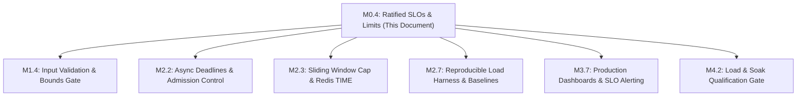

# Steward SLOs, Resource Budgets, and Qualification Environment

**Status:** Ratified  
**Milestone:** M0 — Contract and qualification plan (M0.4)  
**Date:** 2 October 2026  
**Resolves:** F04 (unbounded script work and numeric inputs), F07 (missing deadlines and global admission bounds), F18 (smoke tests lacking production qualification) from [`docs/production-readiness.md`](production-readiness.md)

---

## 1. Executive Summary & Purpose

This specification ratifies the engineering contract for Steward's Service Level Objectives (SLOs), resource budgets, input limits, architectural scope decisions, and benchmark reference environment.

Prior to this specification, Steward lacked explicit service-level commitments, request dimension bounds, execution deadlines, and resource boundaries. As identified in [`docs/production-readiness.md`](production-readiness.md):
- **F04**: Sliding-window work and numeric ranges were unbounded, allowing a single check or backlog pruning to monopolize the Redis primary.
- **F07**: The service operated without an internal request deadline, global admission control, or explicit Envoy client timeouts, exposing worker threads to unbounded blocking.
- **F18**: Existing verification relied on smoke tests that did not measure production throughput, tail latency, or memory stability.

This document serves as the binding reference for implementation and qualification across Milestones M1 through M4.

---

## 2. Service Level Objectives (SLOs)

Steward defines two primary customer-facing SLOs measured over rolling 30-day windows: **Enforcement Availability** and **Decision Latency**.

### 2.1 Enforcement Availability SLO

| Dimension | Target | Qualification Window | Measurement Point |
| :--- | :--- | :--- | :--- |
| **Enforcement Availability** | **$\ge 99.99\%$** | Rolling 30-day window | Envoy RLS gRPC client filter |

#### Definition of Terms
- **Valid RLS Request:** Any gRPC `ShouldRateLimitRequest` received by Steward that conforms to the ratified input limits (§4). Requests rejected at admission due to payload size, descriptor depth, or malformed fields (`INVALID_ARGUMENT`) are considered client errors and are excluded from the availability denominator.
- **Definitive Decision:** An RLS response containing either `OK` (allow) or `OVER_LIMIT` (deny) returned to Envoy within the configured deadline. Both outcomes constitute successful policy enforcement.
- **Enforcement Failure:** Any request that results in:
  1. A gRPC error status (`UNAVAILABLE`, `DEADLINE_EXCEEDED`, `INTERNAL`, `UNKNOWN`).
  2. A deadline expiration at Envoy prior to receiving a response.
  3. A process crash or unhandled panic.
  4. Silent fallback or unconfigured allow caused by backend reachability issues (violating F06).

$$\text{Enforcement Availability} = \frac{\sum (\text{Definitive Decisions: } OK + OVER\_LIMIT)}{\sum \text{Valid RLS Calls Received}} \ge 0.9999$$

#### Error Budget
- At an aggregate steady-state load of 20,000 QPS, a $99.99\%$ target yields an error budget of at most **$0.01\%$** failed calls.
- This corresponds to a budget of at most **51,840 failed decisions per 30-day period** (or an equivalent of at most 4 minutes and 19 seconds of total service unavailability per month).
- **Decoupling from Downstream HTTP Availability:** Downstream HTTP request availability depends on Envoy's configured `failure_mode_deny` strategy and upstream backend availability. Steward's SLO tracks only the enforcement service's ability to render definitive decisions.

---

### 2.2 Decision Latency SLO

At the declared supported load (§6.2), decision latency measured at the **Envoy client** must satisfy the following percentiles:

| Percentile | Latency Target | Condition | Measurement Point |
| :--- | :--- | :--- | :--- |
| **p50** | $\le 1.5\text{ ms}$ | Steady-state supported load (20,000 QPS) | Envoy RLS client metrics |
| **p95** | $\le 3.0\text{ ms}$ | Steady-state supported load (20,000 QPS) | Envoy RLS client metrics |
| **p99** | $\le 5.0\text{ ms}$ | Steady-state supported load (20,000 QPS) | Envoy RLS client metrics |
| **p99.9** | $\le 10.0\text{ ms}$ | Steady-state supported load (20,000 QPS) | Envoy RLS client metrics |

#### Latency Budget Allocation (p99 Budget = 5.0 ms)
The 5.0 ms p99 latency budget is allocated across the end-to-end request path as follows:

```
+-------------------------------------------------------------------------------+
| Total Envoy p99 Budget: 5.0 ms                                                |
+-------------------------------------------------------------------------------+
| Network Round-Trip (Envoy <-> Steward):                         <= 0.8 ms     |
| Steward Request Ingestion & Descriptor Matching:                <= 0.5 ms     |
| Steward Concurrency Admission Wait:                             <= 0.2 ms     |
| Redis Network Round-Trip (Steward <-> Redis Primary):            <= 0.5 ms     |
| Redis Script Evaluation (Lua execution):                        <= 1.5 ms     |
| Steward Response Assembly & Serialization:                      <= 0.5 ms     |
| Safety Margin / OS Jitter:                                      <= 1.0 ms     |
+-------------------------------------------------------------------------------+
```

#### Separation of Allowed vs. Denied Latency
Latency metrics and histograms **must separate allowed decisions from denied decisions**:
1. **Allowed Decisions (`OK`):** Typically evaluate all matched rules and execute mutating state updates in Redis (e.g., token consumption, sorted set insertion).
2. **Denied Decisions (`OVER_LIMIT`):** May short-circuit evaluation or skip counter mutation depending on the policy, or observe different Lua script paths.
3. Reporting aggregated latency across mixed outcomes masks degradation in the mutating path. Dashboards and qualification reports must present separate distributions:
   - `ratelimit.latency.allowed` (p50, p95, p99, p99.9)
   - `ratelimit.latency.denied` (p50, p95, p99, p99.9)

---

## 3. Resource Budgets & Operational Envelopes

### 3.1 Service CPU Budget

- **Steady-State Target:** $\le 70\%$ CPU utilization across 4 vCPUs at 20,000 QPS under steady-state load with at most 2 matched rules per request.
- **Headroom Requirement:** At least $30\%$ CPU headroom is reserved to accommodate:
  - Traffic spikes and sudden burst admission.
  - Policy snapshot reload and background regex/wildcard index compilation.
  - Telemetry flushes and connection renegotiation.
- **Saturation Behavior:** If CPU exceeds $85\%$, global admission controls (§3.3) must shed excess load before queueing induces tail latency violations.

---

### 3.2 Service Memory Budget (RSS)

- **RSS Limit:** $\le 512\text{ MiB}$ Resident Set Size per service instance under continuous steady-state load.
- **Soak Requirement:** **Zero sustained memory growth** over a continuous **6-hour soak test** at 20,000 QPS.
- **Allocation Profile:**
  - Tokio runtime worker thread stacks: bounded by core count ($4 \times 2\text{ MiB} \approx 8\text{ MiB}$).
  - Immutable compiled policy snapshots: held in `Arc<CompiledConfig>` with atomic pointer swaps; old snapshots reclaimed immediately upon request drain.
  - In-flight request contexts: strictly bounded by the global admission semaphore limit ($N \le 1,024$).
  - Redis connection buffers: multiplexed async connections with bounded write rings.
  - Prohibit unbounded buffering, unbounded channel queues, or per-request string heap accumulation.

---

### 3.3 Deadlines, Timeouts, and Admission Bounds

To resolve F07, request lifetimes are bounded hierarchically:

```
[ Envoy Client Timeout: 20 ms ]
      |
      +---> [ Network & Transport Margin: 10 ms ]
      |
      +---> [ Steward Internal Execution Deadline: 10 ms ]
                 |
                 +---> Concurrency Admission Acquire: <= 1 ms
                 +---> Descriptor Matching:           <= 0.5 ms
                 +---> Redis Operation Timeout:       <= 6 ms
                 +---> Response Assembly:             <= 0.5 ms
```

| Boundary | Threshold | Enforcement Mechanism |
| :--- | :--- | :--- |
| **Envoy RPC Timeout** | **$20\text{ ms}$** | Envoy cluster / route rate limit filter timeout. |
| **Steward Internal Deadline** | **$10\text{ ms}$** | `tokio::time::timeout` wrapping total handler execution. |
| **Client Deadline Propagation** | $\min(\text{client\_deadline} - 2\text{ ms}, 10\text{ ms})$ | Evaluated from incoming `grpc-timeout` metadata. |
| **Global Admission Semaphore** | **1,024 concurrent calls** | `tokio::sync::Semaphore`; excess calls rejected immediately (`RESOURCE_EXHAUSTED` / `UNAVAILABLE`). |
| **Redis Command Timeout** | **$6\text{ ms}$** | Per-operation async Redis timeout inside the handler. |

#### Cancellation Safety
- When the internal execution deadline expires or client cancels, the request handler must abort immediately and release admission permits.
- In-flight Redis mutations that have already been transmitted over TCP **must not be blindly retried**. A timeout outcome is classified as ambiguous; retrying risks double-counting quota.

---

### 3.4 Redis Primary Resource Budget

- **CPU Budget:** $\le 65\%$ CPU utilization on the Redis primary under 20,000 QPS steady-state load.
- **Script Execution Budget:**
  - Lua script execution time: p99 $\le 1.0\text{ ms}$, p99.9 $\le 2.5\text{ ms}$.
  - Any Lua script exceeding $5.0\text{ ms}$ is treated as a critical performance defect.
- **Memory & Eviction:**
  - Redis memory policy: `maxmemory-policy noeviction`.
  - Memory headroom: Proactive warning alerts triggered at $75\%$ memory utilization; critical alarms at $85\%$.
  - Dedicated storage: Redis primary instance must not be shared with caching layers or unbudgeted workloads.

---

## 4. Input, Dimension, and State Limits

To resolve F04, all input message dimensions and per-key state storage are constrained by hard limits:

| Dimension / Parameter | Ratified Limit | Validation Stage | Action on Exceeded |
| :--- | :--- | :--- | :--- |
| **Max RPC Payload Size** | **$64\text{ KiB}$** | gRPC frame ingestion (Tonic) | Fast reject: `RESOURCE_EXHAUSTED` |
| **Max Descriptors per Call** | **16** | Request validation gate | Fast reject: `INVALID_ARGUMENT` |
| **Max Entries per Descriptor** | **8** | Request validation gate | Fast reject: `INVALID_ARGUMENT` |
| **Max Entry Key/Value Length** | **256 bytes** | Request validation gate | Fast reject: `INVALID_ARGUMENT` |
| **Max Hit Cost (`hits_addend`)** | **100 hits** | Request / descriptor validation | Fast reject: `INVALID_ARGUMENT` |
| **Max Sliding Retained Events**| **10,000 events/key** | Lua script state check / trim | Prune / reject excess |
| **Policy Capacity Numeric Range** | `1` to `u32::MAX` ($2^{32}-1$) | Snapshot compilation | Reject policy snapshot reload |

### Validation Contract
1. **Pre-Evaluation Rejection:** Limit checks on descriptors, entries, string lengths, and hit costs must execute **before** allocating counter keys, querying Redis, or acquiring concurrency permits.
2. **Explicit Error Status:** Requests exceeding these limits return gRPC `Status::invalid_argument` with human-readable error metadata specifying the breached limit.
3. **Metric Tracking:** All validation rejections increment `ratelimit.service.rejected_invalid_request` with the rejection reason.

---

## 5. Architectural Scope Ratifications

Milestone M0 requires explicit ratification on two architectural design questions: exact sliding logs vs. approximate algorithms, and independent token burst capacity.

### 5.1 Exact Sliding Logs vs. Approximate Bounded Algorithms

#### Problem Context
Sliding-window rate limiting can be implemented in two ways:
1. **Exact Sliding Log:** Uses a Redis Sorted Set (`ZSET`) where each hit is recorded as an individual timestamped member. Provides 100% boundary accuracy, but memory and CPU scale with hit volume ($O(N)$ insertion and pruning).
2. **Approximate Bounded Algorithm (e.g., Dual-Window Sliding Counter):** Approximates the sliding count using weighted interpolation between the previous fixed window and current fixed window:
   $$\text{Count} = \text{Count}_{\text{current}} + \text{Count}_{\text{previous}} \times (1 - \text{elapsed\_fraction})$$
   Provides strictly $O(1)$ constant memory and constant CPU time, but introduces an approximation error of up to $5\%$ on step-function traffic spikes.

#### Ratification Decision
1. **Ratified Baseline for M1/M2:** Steward **officially ratifies the Exact Sliding Log**, constrained by the following mandatory bounds:
   - Hard cap of **max 100 hits per call**.
   - Hard cap of **max 10,000 retained events per key**.
   - Authoritative Redis `TIME` (F03) to eliminate client clock skew.
   - Globally unique event members combining Redis cluster-safe sequence numbers or high-resolution IDs (F03).
   - Atomic pruning (`ZREMRANGEBYSCORE`) bounded to prevent Redis event loops.
2. **Operational Guardrail:** Workloads requiring sustained high event counts ($> 10,000$ events per window) must use **token-bucket** or **fixed-window** algorithms.
3. **Escalation Path (M2.7 Gate):** During Milestone M2.7 load qualification, if exact sliding log evaluation under worst-case pruning/insertion violates the Redis script budget (p99 $\le 1.0\text{ ms}$), Steward will evaluate introducing an approximate bounded-state sliding algorithm as an alternative engine in M3.

---

### 5.2 Independent Token Burst Capacity

#### Problem Context
In token-bucket rate limiting, the bucket refills at a continuous rate up to a maximum burst capacity:
- **Coupled Model (Current):** `burst_capacity = capacity = requests_per_unit`. The maximum tokens that can accumulate equals the rate per unit interval.
- **Decoupled Model:** Policy explicitly defines both `refill_rate` (e.g., 100 req/sec) and `burst_capacity` (e.g., 500 tokens), allowing short bursts while restricting sustained throughput.

#### Ratification Decision
1. **Ratified Baseline for M1/M2:** Steward **ratifies that independent token burst capacity is DEFERRED from the initial M1/M2 scope**. The baseline implementation couples burst capacity to `requests_per_unit`.
2. **Extensibility Requirement:** While deferred from active configuration, the internal data structures and Redis Lua scripts designed in M2.3/M2.4 **must be architected to accept an optional `burst_capacity` parameter**. This ensures that enabling decoupled burst capacity in M3 will require only policy schema changes without modifying or invalidating the Redis state layout.

---

## 6. Benchmark Reference Environment

To eliminate ambiguity and resolve F18, all qualification benchmarks (M2.7, M4.2) must execute against the ratified reference environment defined below.

### 6.1 Hardware and Network Topology

```
+-------------------------------------------------------+
| Availability Zone A                                   |
|                                                       |
|  +---------------------+       +-------------------+  |
|  | Steward Instance    |       | Redis Primary     |  |
|  | - 4 vCPU            | <---> | - 2 vCPU          |  |
|  | - 8 GiB RAM         |  RTT  | - 4 GiB RAM       |  |
|  | - Linux 6.x         | <=0.5 | - Standalone/HA   |  |
|  +---------------------+   ms  +-------------------+  |
|            ^                                          |
|            | gRPC                                     |
|  +---------------------+                              |
|  | Load Generator      |                              |
|  | (Open-Loop Engine)  |                              |
|  +---------------------+                              |
+-------------------------------------------------------+
```

| Component | Specification | Deployment Constraints |
| :--- | :--- | :--- |
| **Service Instance** | 4 vCPU (compute-optimized x86_64 / ARM64), 8 GiB RAM | Dedicated instance / container; no CPU throttling. |
| **Redis Primary** | 2 vCPU, 4 GiB RAM | Dedicated instance, Redis 7.x, `maxmemory-policy noeviction`. |
| **Network Placement** | Same Cloud Availability Zone (AZ) | Direct VPC peering; network round-trip time **$\text{RTT} \le 0.5\text{ ms}$**. |
| **Client Workload Engine** | Open-loop load generator (e.g., `ghz` or Rust generator) | Dedicated host; open-loop dispatch to avoid coordinated omission. |

---

### 6.2 Workload Specifications

| Parameter | Ratified Benchmark Value | Notes |
| :--- | :--- | :--- |
| **Steady-State Throughput** | **20,000 RLS calls / second** | Fixed-window and token-bucket policies. |
| **Matched Rules per Call** | **$\le 2$ matched rules** | Representative multi-policy evaluation. |
| **Decision Outcome Mix** | **$90\%$ Allowed (`OK`), $10\%$ Denied (`OVER_LIMIT`)** | Baseline qualification mix. |
| **Hit Cost Distribution** | Baseline: $1\text{ hit}$ ($95\%$), $10\text{ hits}$ ($4\%$), $100\text{ hits}$ ($1\%$) | Stresses weighted accounting. |
| **Key Distribution** | 1. Uniform (flat across $100,000$ active keys)<br>2. Zipfian skew ($\alpha = 0.8$, $80/20$ Pareto) | Validates single-counter serialization. |
| **Active Cardinality** | $100,000$ active counter identities | Sizing based on 10,000 new identities/min. |

---

### 6.3 Test Matrix and Soak Protocol

| Test Phase | Duration | Offered Load | Primary Pass Criteria |
| :--- | :--- | :--- | :--- |
| **Baseline Performance** | 30 minutes | 20,000 QPS (open-loop) | p99 $\le 5\text{ ms}$, CPU $\le 70\%$, zero errors. |
| **Saturation Sweep** | 15 minutes | 10k $\rightarrow$ 35k QPS (stepwise) | Identify knee point; graceful load shedding at saturation. |
| **Memory Soak Test** | **6 hours** | 20,000 QPS sustained | RSS $\le 512\text{ MiB}$; **zero sustained memory growth**. |
| **Fault Injection** | 15 minutes | 20,000 QPS with 10 ms Redis delays | Bounded timeout ($\le 10\text{ ms}$), no thread starvation. |

---

## 7. Downstream Traceability & Dependencies

This specification establishes binding requirements for the following milestone tasks:



- **[M1.4 (Issue #10)](https://github.com/cetanu/steward/issues/10):** Implements request validation enforcing the limits in §4 (descriptors $\le 16$, entries $\le 8$, hit cost $\le 100$).
- **[M2.2 (Issue #14)](https://github.com/cetanu/steward/issues/14):** Implements the 10 ms internal deadline, 1,024 global admission semaphore, and cancellation handling from §3.3.
- **[M2.3 (Issue #15)](https://github.com/cetanu/steward/issues/15):** Implements the 10,000 sliding-window event cap, Lua `TIME`, and cluster-unique member IDs from §4 and §5.1.
- **[M2.7 (Issue #19)](https://github.com/cetanu/steward/issues/19):** Executes the open-loop benchmark harness against the reference environment in §6.
- **[M3.7 (Issue #26)](https://github.com/cetanu/steward/issues/26):** Establishes Prometheus/Grafana dashboards and alerts tracking the 30-day availability SLO (§2.1) and p99 latency SLO (§2.2).
- **[M4.2 (Issue #28)](https://github.com/cetanu/steward/issues/28):** Executes the 6-hour soak and load sweep certifying the resource budgets in §3.

---

## 8. Ratification & Approval Record

| Role | Name / Function | Status | Date |
| :--- | :--- | :--- | :--- |
| **Service Engineering** | Steward Core Team | **Ratified** | 2 October 2026 |
| **Platform / SRE** | Production Infrastructure | **Ratified** | 2 October 2026 |
| **Envoy Gateway Owner** | Traffic Platform | **Ratified** | 2 October 2026 |
